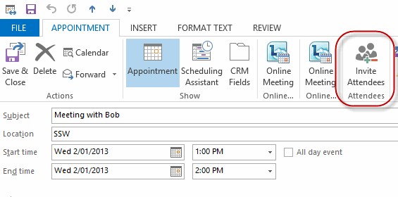
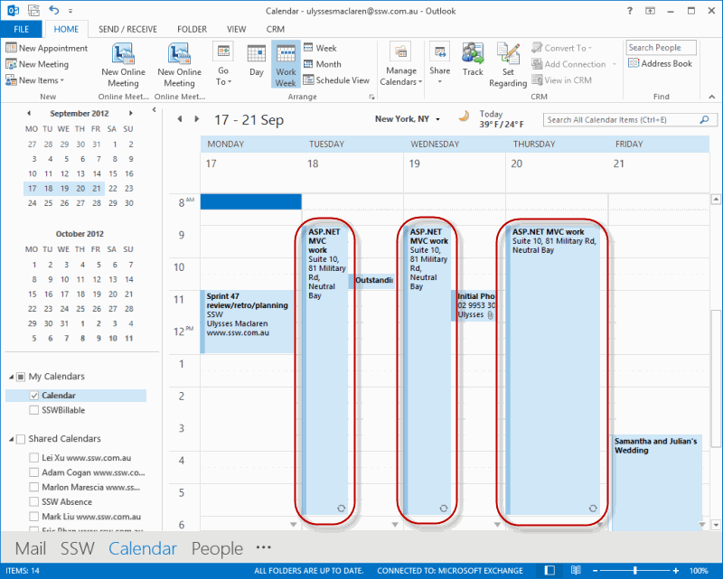

If you wish to organize a meeting that involves some of your colleagues and a client, instead of sending an email, send an appointment. Sending appointments is convenient because all the user has to do is click 'accept' and it is in their calendar. 
 
This way Outlook will remind your colleagues about the appointment and you can update them if any changes are made.

If the appointment is for     **3 days or less**, send a separate appointment for each day. This is because multiple-day appointments appear at the top in your Outlook Calendar, so you risk missing the appointment (see below).
](BadMultipleDayAppointment.gif)
You should always have calendar on your phone, so we can quickly add a client booking into the calendar, then add a note what to do with CRM (e.g. Uly please set regarding flag).
