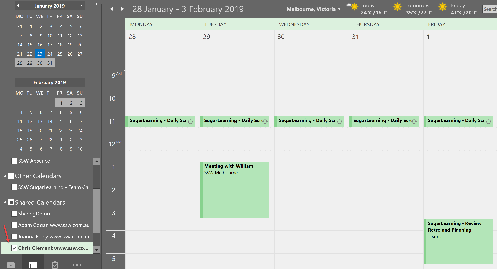
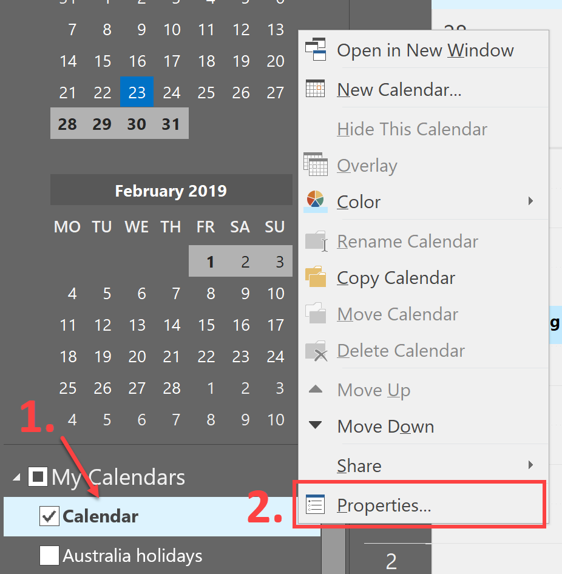
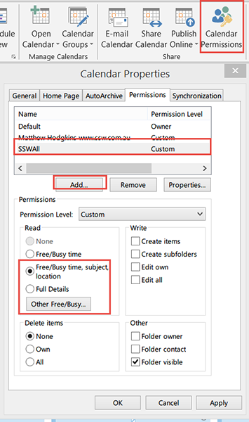
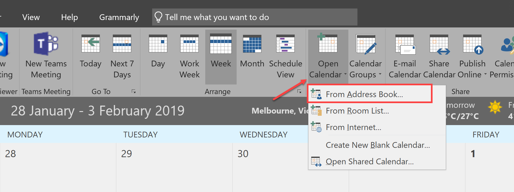
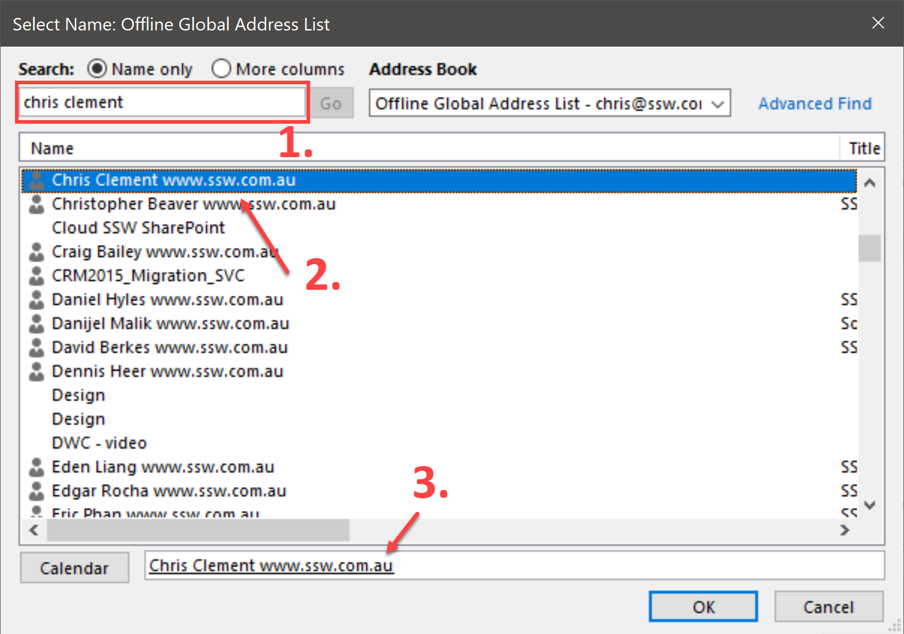
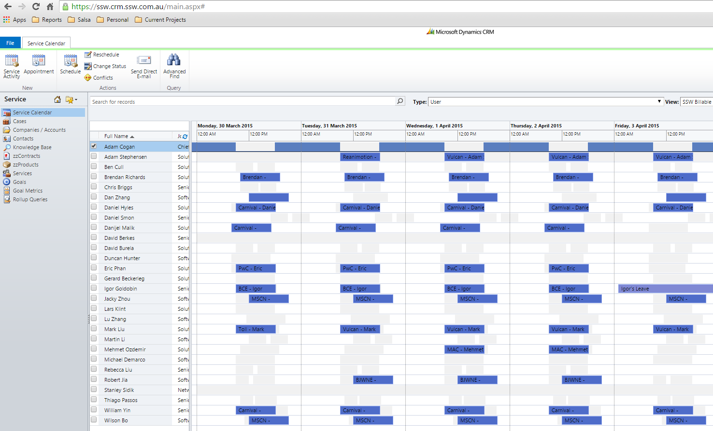
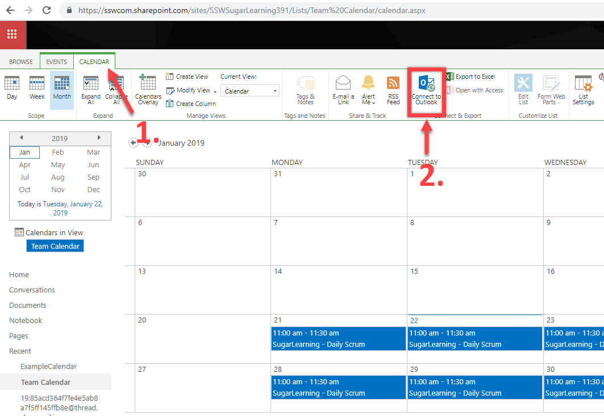
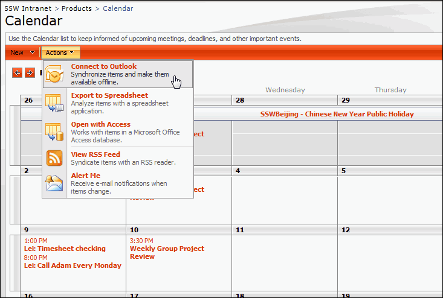

While working in a team, there are three ways of seeing others' or team calendars.
 
### Option 1: Using Outlook Calendar - See a person's calendar

You can share your Outlook calendar with another person or a group in Outlook. This option is useful when you want to share your personal calendar with others.

In the example below, Chris is going to share his personal calendar with the "SSWAll" group, so they can see what's he's doing from Outlook calendar.
 

Here's how to share your calendar (in this example, with a group):
 

 
 Figure: On the permission tab, click "Add..." to add a person (or a group). You can also choose the details you want to share with them (Outlook 365 v1812)

#### If you are still using Outlook 2016...

 
(Outlook 2016 v1812 and older)
 Then the other person will receive a sharing notification email:
 

Here's how to open someone's calendar in  Outlook (if they have shared it with you):

 
(this opens the Global Address List)
 

### Option 2: Using the CRM Service Calendar - See everyone's calendar

When you want to see what's your colleague's is doing, you can use the CRM Service Calendar.

This can keep track of important things like client work and leave. See [Scheduling - Do you know how to book developers for a project?](/_layouts/15/FIXUPREDIRECT.ASPX?WebId=3dfc0e07-e23a-4cbb-aac2-e778b71166a2&TermSetId=07da3ddf-0924-4cd2-a6d4-a4809ae20160&TermId=d51b4fd0-dc73-4e51-a6fd-e2354b6add89) on how to add a booking to CRM Service Calendar.
 

**Note:**  This will only show appointments that have been tracked in CRM.

### Option 3: Using SharePoint's calendars - See a team's calendar

You can also create a calendar in SharePoint which will be shared with the team in that SharePoint site. By sharing a calendar using SharePoint, new developers who have just joined the team can immediately look at the project's events (e.g. Daily Scrum meeting).

In this scenario, the scrum master of "SSWSugarLearning" wants to share the calendar called "Team Calendar" with his team.

To share a team calendar, you just need to give the calendar URL to the person in your team.

e.g. https://sswcom.sharepoint.com/sites/SSWSugarLearning391/Lists/Team%20Calendar/calendar.aspx

**Tip:** You can also connect the SharePoint calendar to your Outlook. Here's how to do that:
 

#### If you are still using SharePoint 2007...

 

