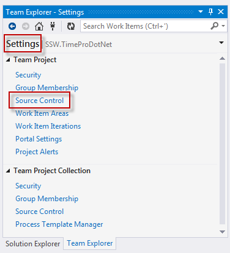
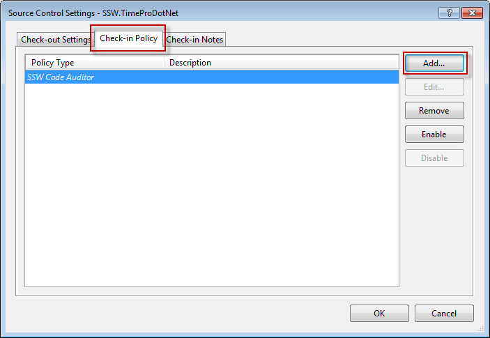
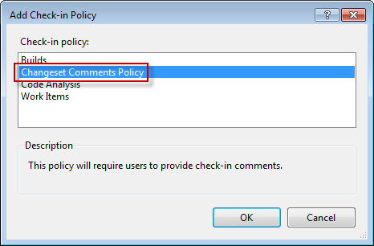
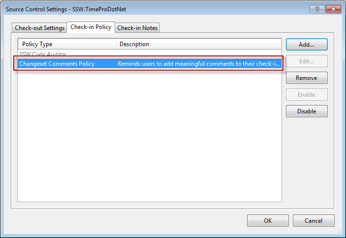

Team Foundation Server is great, and one of its neat features is enforcing comments when checking in code. Without comments, some of the other built in features like History become redundant without comments.  

*You should have good comments… if you are struggling use [this](http://programmingexcuses.com/).*

[[badExample]]
|  

[[goodExample]]
|  

In Visual Studio 2013, to enforce this behaviour, you will need to:

Now the next time someone checks-in some code, they are forced to enter a comment.
