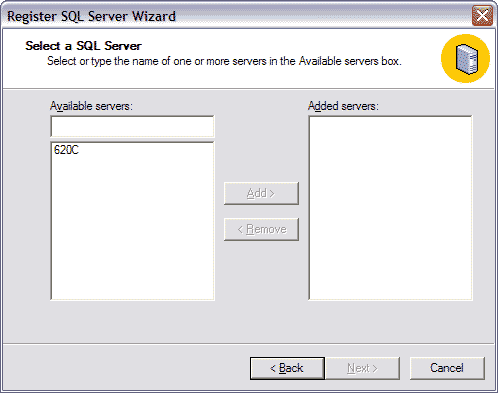

ComboBoxes are better than List Boxes **for data entry** because:

- They occupy less screen space
- They are less trouble to scroll through, owing to the fact that you can afford to have more room for the list (as it's collapsed most of the time)
- As you can see in the figures below, using a combo also makes the required field indicator (\*) easier to see.

 
[[badExample]]
| 
[[goodExample]]
| 
**Note: When are single-select list boxes OK?**

As mentioned before, there are exceptions to this rule. It would be hard to imagine the Include/Exclude boxes in the SQL Server Enterprise Manager's Server Registration Wizard being handled with ComboBoxes, for example.

| We have a program called [SSW Code Auditor](http://www.ssw.com.au/ssw/CodeAuditor/) to check for this rule. |
| --- |
