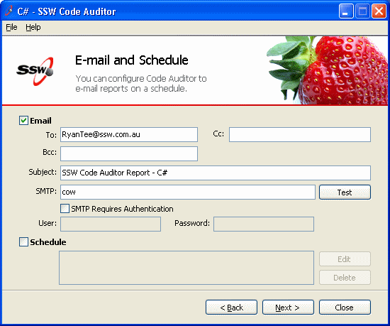
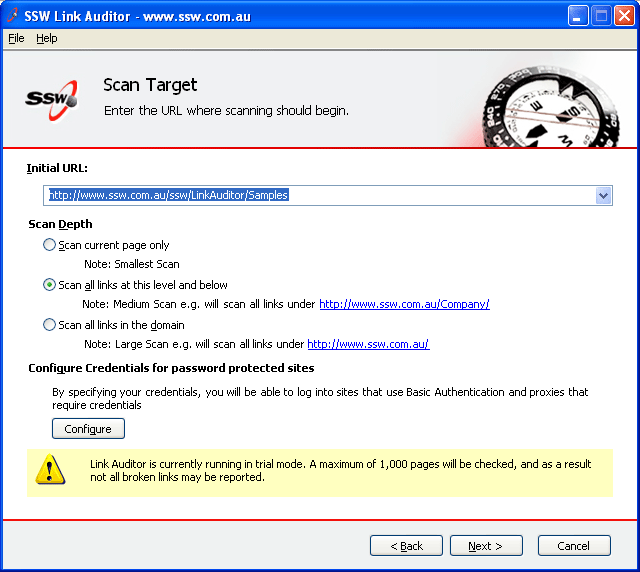

If the option only contains 2 choices, and the answer is a Boolean type value where the opposite value is clear (e.g. Enabled/Disabled, True/False, Yes/No, On/Off), it should always be a checkbox.

[[badExample]]
| 
[[goodExample]]
| 
<!--endintro-->

Only 1 CheckBox is used as the opposite value is clear, such controls are often CheckBoxes in a ListView too. E.g.:

[[goodExample]]
| 
CheckBoxes are also suitable to use for enable or disable sections and to tell the user that these sections do not need configuring for the application to run.

[[goodExample]]
| (although no opposite values), because they are clear when the CheckBoxes aren't ticked, the sections are disabled 
[[badExample]]
| 
[[goodExample]]
| 
If there are only two options available on the form (usually a yes/no answer), the use of a checkbox is more intuitive than radio buttons. Only use radio buttons if there are more than two options.

[[badExample]]
| 
[[goodExample]]
| 
