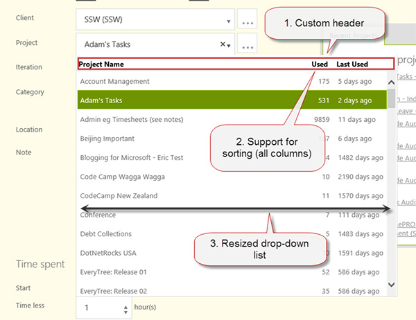
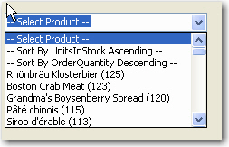
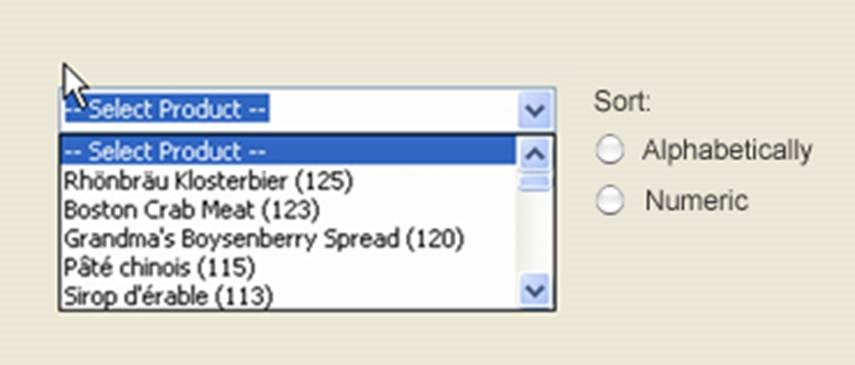

When designing your form, you should try to help your user whenever it's possible. So it's a good idea to include the number of results in ComboBoxes.
   ​For Web Pages  
[[goodExample]]
|  

1. Download and install Kendo UI Controls from [Kendo UI](http://www.kendoui.com/)
2. **HTML (Razor)**
Create a combo-box that has a custom template. Use a code bellow as an example:

@(Html.Kendo().ComboBoxFor(x => x.EmpTime.ProjectID)
.AutoBind(true)
.Suggest(true)
.Delay(300)
.DataSource(source => source.Read(read => read.Action("ProjectNameAjaxBind", "Ajax")
.Data("function() { return {clientId : getClientId()}; }")
.Type(HttpVerbs.Post)))
.Height(450)
.DataTextField("DisplayText")
.DataValueField("Value")
.Filter(FilterType.Contains)
.Template(@"


|
 ${data.DisplayText} |
 ${data.UsedCount} |
 ${data.LastUsedText} |
| --- | --- | --- |


")
.HighlightFirst(false)
.IgnoreCase(true)
.Events(e => e.Change("projectChanged").Open("onProjectOpened"))
)
3. **CSS**
Customize the look & feel to suit your needs.

```
#projectsTableBorder { border-bottom: 1px solid rgb(217, 217, 217);​​​ margin: 0 -2px; } .comboBox-Projects#projectsHeader { color: black; font-weight: bold; margin: 4px 16px 4px 4px; } .comboBox-Projects td.projectName { width: 400px; text-align: left; } .comboBox-Projects td.projectTotalCount { width: 70px; text-align: right; padding-right: 16px; } .comboBox-Projects td.projectLastUsed { text-align: left; } #projectNameHeader:hover, #projectTotalCountHeader:hover, #projectLastUsedHeader:hover { cursor: pointer; text-decoration: underline; }​
```
4. **JavaScript**
Use JavaScript to change the combo-box's behaviour.

```
// resize the drop-down listfunction resizeComboBoxList(comboBoxListId, width) { var list = $(comboBoxListId); list.width(width); var height = list.height(); list.children("ul").height(height - 25);}function onProjectOpened() { resizeComboBoxList("#EmpTime_ProjectID-list", 600);}// execute sorting when a header column is clickedfunction onClick_ColumnHeader(senderId, comboBoxId, fieldName) { var column = $(senderId); column.unbind('click'); column.click(function() { sortComboBoxBy(comboBoxId, fieldName); });}// sort any combo-box based on a field namefunction sortComboBoxBy(comboBoxId, fieldName) { var comboBox = $(comboBoxId).data("kendoComboBox"); var sortDescriptors = comboBox.dataSource._sort; var direction = "asc"; if (typeof(sortDescriptors) != "undefined") { var sortDescriptor = sortDescriptors[0]; if (typeof(sortDescriptor) != "undefined") { if (sortDescriptor["field"] == fieldName) { if (sortDescriptor["dir"] == "asc") { direction = "desc"; } } } } comboBox.dataSource.sort({ field: fieldName, dir: direction, });}// prepare $(document).ready(function() { var projectsId = "#EmpTime_ProjectID"; var projectsListId = projectsId + '-list'; // prepend header to combo-box list. By default you only get  $(" Project Name" + "Used" + "Last Used" + "" + "") .prependTo(projectsListId); // register click events for each column onClick_ColumnHeader('#projectNameHeader', projectsId, "DisplayText"); onClick_ColumnHeader('#projectTotalCountHeader', projectsId, "UsedCount"); onClick_ColumnHeader('#projectLastUsedHeader', projectsId, "LastUsedValue");});});​
```


### For Windows Forms
 
[[badExample]]
|  

[[goodExample]]
|  

[[badExample]]
|  

[[badExample]]
|  

We believe all combos should be able to be sorted ascending/descending and by popularity asc/desc.
 
[[goodExample]]
| 
