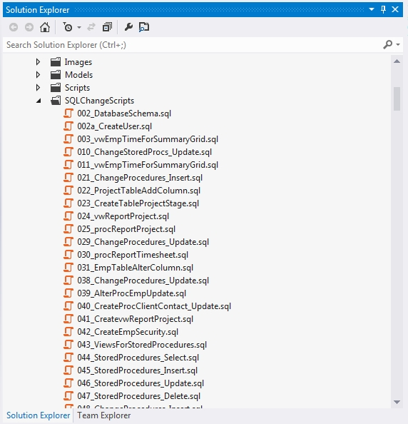

Every time a change is made to your product's SQL Server Database, script out the change. You can use Enterprise Manager, VS.NET or Query Analyzer but every time you make changes you must save the change as a .sql script file so any alterations are scripted. Everything at SSW is usually done three times, once on Development, once on Staging and once on Production. Change control is one of the most important processes in ensuring a stable database system.

Keep the scripts in a separate directory to any other scripts or files. This way you can always go back to them and find out what alterations you have made to the database in version xxx to find errors. If you have all the scripts you are able to rebuild the database from scratch. At SSW we name this folder SQLChangeScripts so as to not confuse it with other script folders.
 
The script file format should be: \_.sql

The  should be a number which is padded with leading zeros (0) on the right to firm 3 or 4 digits (however long we need).
