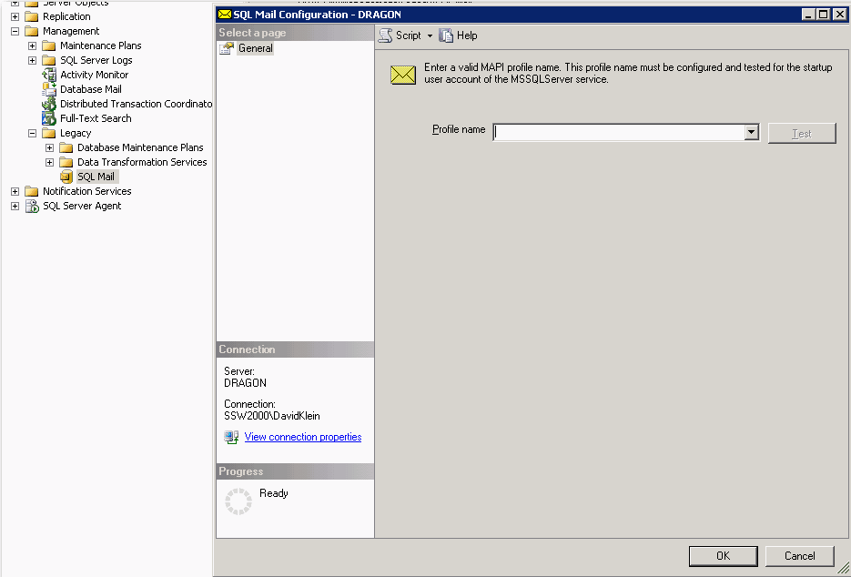
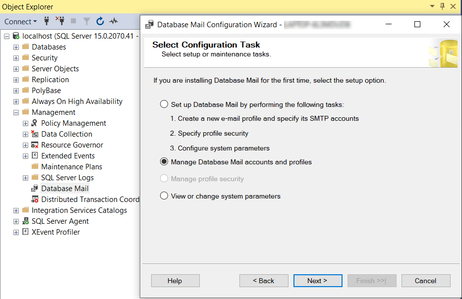

SQL Server includes Database Mail (it was a new feature released back in 2005 as a replacement for SQL Mail). Database Mail is a great feature as it allows:

- HTML messages natively supported - so there's no need to use 3rd party dlls anymore
- Communication direct with SMTP server - There's no need for outlook or MAPI profiles on server
- Multiple profiles and accounts supported to specify multiple SMTP servers or different email infrastructure situations
- SQL Server queues messages even when the external mailing process fails
- High security - users and roles have to be granted permission to send mail
- Logging and auditing
- Attachment size regulations and file extension requirements

 
[[badExample]]
| 
EXEC master.dbo.xp\_smtp\_sendmail
@FROM = N'your@email.com',
@FROM\_NAME = N'Sophie Belle',
@TO = 'recipient@email.com',
@subject = 'Vendor List',
@message = 'The list of vendors is attached.',
@type = N'text/html',
@server = N'mail.company.com.au'
Figure: Bad example - Avoid using SQL Mail -  you need to have Outlook on the server and there is no built-in logging

[[goodExample]]
| 
USE msdb
Execute dbo.sp\_send\_dbmail
@profile\_name = 'UTS',
@recipients = 'your@email.com,
@body = 'The list of vendors is attached.',
@query = 'USE AdventureWorks; SELECT VendorID, Name FROM Purchasing.Vendor',
@subject = 'Vendor List',
@attach\_query\_result\_as\_file = 1
Figure: Good example - Use database mail for scalability, built-in logging and HTML capability
