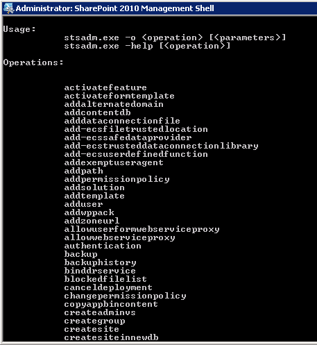
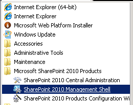
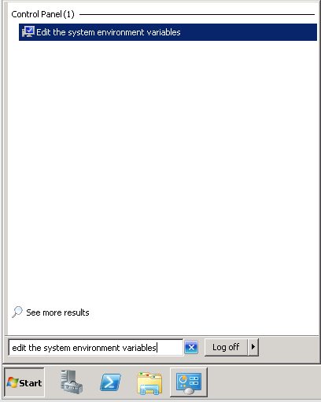

In SharePoint 2007, it is a good idea to add the path to stsadm.exe into the environment variables on a SharePoint server so you can open a command prompt and run the tool from anywhere.

!In SharePoint 2010, you can skip quite a few steps by using the PowerShell Console.

**More Information** for SharePoint 2007

1. In the start menu type  **Edit the system environment variables** and run the tool
 
     Figure 1 - Search for "Edit the system environment variables” in the Start Menu
2. In the  **System variables** section, select  **Path** and click  **Edit
** 
 
     Figure 2 - Under System Variables | Select Path | Click Edit
3. Add the path at the end of the  **Variable Value**
    1. For a SharePoint 2007 Server, enter:
**;C:\Program Files\Common Files\Microsoft Shared\Web Server Extensions\12\bin**
4. You may need to reboot the server
5. You can now run  **stsadm** from anywhere in the command prompt
