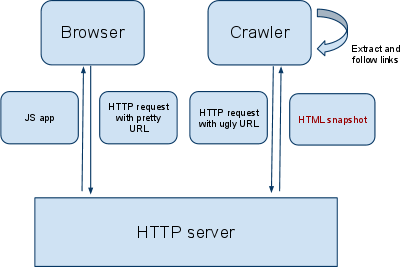

Search Engine Optimisation (SEO) with a Single Page Application (SPA) needs consideration like any other Framework to ensure it is SEO friendly. Becuase AngularJS manages your routing and URLs it is important to be aware of the differences in making an AngularJS SPA SEO friendly.
 
If you ignore your SEO in an Angular SPA you may not have your pages indexed by Google and lose your ranking with SEO. If your pages are not being rendered to Googles bots when they crawl your site, Google can not see your pages and it is like they do not exist.

[greyBox]
 The only way to be sure your Angular SPA will be crawled and indexed properly by Google Bots is to intercept all their requests and serve them HTML you pre-render on the server.  
[/greyBox]

It is not enough to just use hashes in your URLs (e.g., www.example.com/index.html#mystate, where #mystate is the hash fragment) or hope Google can crawl and Angular application correctly. You can read more here [Guide to AJAX crawlin g for webmasters and developers](https://developers.google.com/webmasters/ajax-crawling/docs/getting-started).  There are several libraries to help pre-render your code available on the internet. 

If you do not pre-render HTML you may still get good enough SEO as Google Bots are getting better at crawling JavaScript but you can not be certain it will work. You can use [Google Fetch](https://www.google.com/webmasters/tools/googlebot-fetch) to test how your web pages look to a Google bot.
 

Besides pre-rendering HTML to get your AngularJS Single Page Application (SPA) SEO friendly you can apply the following practices:

1. **Enable html5Mode for AngularJS outing** 
This will remove the hashtagged-URLs by default for pretty URLS, using the pushState feature that newer browsers have, which still falls back to the hashbang method if pushState isn't available. To enable html5Mode in AngularJs read more [scotch.io](http://scotch.io/quick-tips/js/angular/pretty-urls-in-angularjs-removing-the-hashtag)
2. **Creating a sitemap** 
Web crawlers usually discover pages from links within the site and from other sites. Sitemaps supplement this data to allow crawlers that support Sitemaps to pick up all URLs in the Sitemap and learn about those URLs using the associated metadata. Using the Sitemap protocol does not guarantee that web pages are included in search engines, but provides hints for web crawlers to do a better job of crawling your site.  More information at  [sitemap.org](http://www.sitemaps.org/protocol.html)
3. **Enriching your app with meta information** 
This step ensures your search results are represented in a meaningful and predictable way. Dynamically changing the meta tags content in the head section of the page can also help google find and represent you in their search results.  
For more information and a demo see this  blog: [weluse.de](https://weluse.de/blog/angularjs-seo-finally-a-piece-of-cake.html)
4. **You can inspect what HTML Google renders with Webmaster Tools** , it is also an excellent source of information.
5. Here’s what you need to know to ensure your website is crawled correctly by Google in general regardless of if your application is a SPA: [Introduction to SEO and Google Tools – Craig Bailey \[FireBootCamp\]](https://tv.ssw.com/5162/introduction-seo-google-tools-craig-bailey-firebootcamp)

**Note:** Since May 2014 Google announced that they're finally crawling javascript making SEO for a SPA simpler. Previously your SPA needed to distinguish between normal users and crawlers - and re-route (somehow) to the special crawler-only-endpoints if a bot is requesting the page.(source: http://googlewebmastercentral.blogspot.de/2014/05/understanding-web-pages-better.html)
