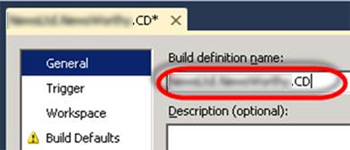
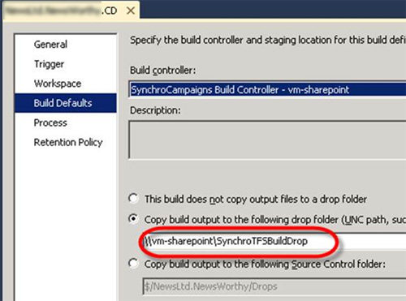
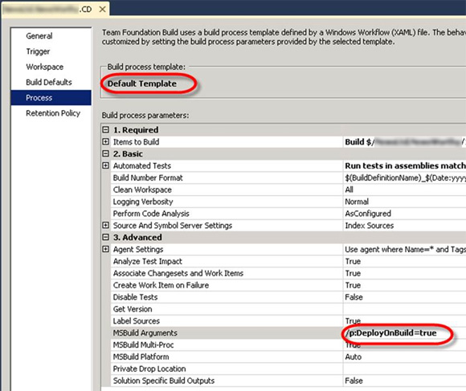
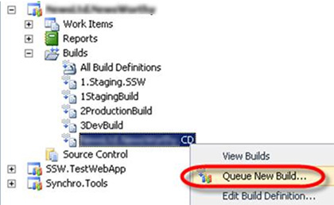
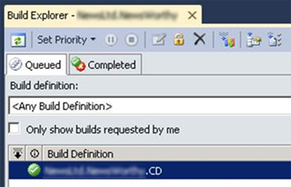

(Before you configure continuous deployment) You need to ensure that the code that you have on the server compiles. A successful CI build without deployment lets you know the solution will compile.
 

(where you drop your builds)

