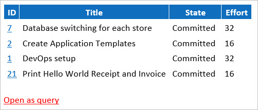

 
​After the [Sprint Planning](/Pages/SprintPlanningMeeting.aspx)[Meeting](/Pages/SprintPlanningMeeting.aspx), it is useful for the Development Team to send the Product Owner (PO) a Sprint Forecast for the next Sprint. Doing this helps to improve common understanding in, and sometimes to enforce, the relationship between the PO and the Team.​

This is simply an agreement between the Development Team and the PO for one Sprint and should be confirmed via an e-mail at the beginning of every Sprint.

 

> “The implementation team agrees to do its best to deliver an agreed on set of features (scope) to a defined quality standard by the end of the sprint. (Ideally they deliver what they promised, or even a bit more.) The Product Owner agrees not to change his instructions before the end of the Sprint.”
> 
> **- Agile Project management**

Each of the Sprints in a Scrum project can be considered a mini-project that has Time (Sprint Length), Scope (Sprint Backlog), Quality (Definition of Done) and Cost (Team Size\*Sprint Length). Only the scope can vary and this is measured every sprint.

**Hi [Product Owner], **

| Current Sprint: | [Sprint Number] |
| --- | --- |
| Sprint Duration: | [Number of weeks] |
| Sprint Goal: | [Main goal of Sprint] |
| Project: | [Project Name] |
| Project Portal: | [Link to project Portal] |
| Product Owner: | [Product Owner Name] |
| ​Sprint Review Meeting: | [Date and Time] |

Attendees: [Names of Attendees]

As per our Sprint Planning Meeting, and as the Product Owner, you have agreed to the following Product Backlog Items (PBIs) being included in the current sprint backlog.

The Team will do its best to deliver this set of features (Scope), to a defined quality standard (Definition of Done) by the end of the sprint. Ideally, the team will deliver what they forecast, or even a bit more, but this can't be guaranteed.

| **ID** | **Title** | **State** | **Effort** |
| --- | --- | --- | --- |
|  |  |  |  |
|  | < generate this table as per the instruction on the rule below > |  |  |
|  |  |  |  |

** Figure: The sprint backlog**

[https://rules.ssw.com.au/do-you-create-a-sprint-forecast-(aka-the-functionality-that-will-be-developed-during-the-sprint)](/_layouts/15/FIXUPREDIRECT.ASPX?WebId=3dfc0e07-e23a-4cbb-aac2-e778b71166a2&TermSetId=07da3ddf-0924-4cd2-a6d4-a4809ae20160&TermId=9119c922-1478-49e3-9d7a-903e9bc4be6e) />

**Figure: Good Example - copy this as email template and send to Product Owner. 
****Subject: : Sprint xxx Forecast**
Tip: Use this     [Outlook email template](/Documents/SprintContract.oft "Email Template")

More instructions are as below:

1. Go to Azure DevOps and navig​ate to the current sprint's backlog view. E.g. https://dev.azure.com/Northwind/ProjectName/\_sprints/backlog/Northwind/ProjectName/Sprint%201
2. Paste to the Forecast email, and format the table:
    - Remove any useless columns

    Figure: Good Example of a Table

