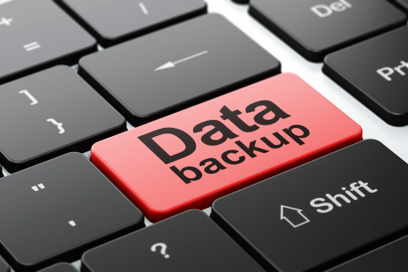
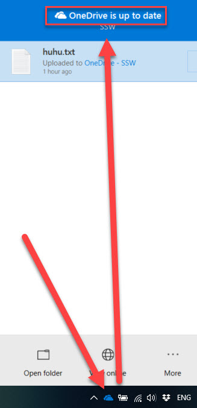

Using a standard file structure for storing user data on laptops makes locating the important information fast and performing automated backup operations easy - Use this checklist.

Remember, the expectation is for all the questions to be answered with "YES" by the end of this checklist.

 

###  Domain-joined checklist:

[[greyBox]]
| :::
 **1. Is your computer domain-joined? [ - ]** 
Note: To check, go to Start menu | This PC | Right-click | Properties | Check if "Workgroup" is Sydney.ssw.com.au.
If yes, then your computer is domain-joined.

 **2. The Backup Script - Date Last Run: [ \_\_/\_\_/\_\_\_\_ ]** 
If your computer is domain-joined, then your backup script should already be working daily at 11 am. 
Go to \\fileserver.sydney.ssw.com.au\UserBackups\ztBackupScripts\UserLogs.log to see the last time your backup was done.  

  
 **3. The Login Script - Date Last Run: [ \_\_/\_\_/\_\_\_\_ ]** 
If your computer is domain-joined, the Login Script should have run already when you logged in. Go to your C:\ drive and look for SSWLoginScript.log. Open it and see the last time it was run.
 **
Now go through the non-domain-joined checklist.   
** 

:::

### Non-domain-joined checklist:

**1. Do you use a cloud backup application? [ - ] 
Which one? [ \_\_\_\_\_\_\_\_\_\_\_\_\_\_\_\_\_\_\_\_\_\_\_\_\_\_\_\_\_\_\_\_\_\_\_\_\_\_\_\_\_\_\_\_\_\_\_\_\_\_ ]
**

Some good options include OneDrive for Business and Dropbox. You should always keep important files in the cloud for security reasons. Read [https://rules.ssw.com.au/pc-do-you-use-the-best-backup-solution](/_layouts/15/FIXUPREDIRECT.ASPX?WebId=3dfc0e07-e23a-4cbb-aac2-e778b71166a2&TermSetId=07da3ddf-0924-4cd2-a6d4-a4809ae20160&TermId=68798bd6-a0fa-49ee-89ea-d4d0d11930f1)

 **
2. Do you keep your files in one folder structure? [ - ] 
Location:\_\_\_\_\_\_\_\_\_\_\_\_\_\_\_\_\_\_\_\_\_\_\_\_\_\_\_\_\_\_\_\_\_\_\_\_\_\_\_\_\_\_\_\_\_\_\_\_\_\_\_\_\_ Size: \_\_\_\_ GB of\_\_\_\_ GB  Errors  [  ]
Location (optional):\_\_\_\_\_\_\_\_\_\_\_\_\_\_\_\_\_\_\_\_\_\_\_\_\_\_\_\_\_\_\_\_\_\_\_\_\_\_\_\_\_ Size: \_\_\_\_GB of\_\_\_\_ GB  Errors  [  ]
Location (optional):\_\_\_\_\_\_\_\_\_\_\_\_\_\_\_\_\_\_\_\_\_\_\_\_\_\_\_\_\_\_\_\_\_\_\_\_\_\_\_\_\_ Size: \_\_\_\_GB of\_\_\_\_ GB  Errors  [  ]
**

Note: For OneDrive the default is: C:\Users\[UserName]\OneDrive
Tip: You can have additional accounts in the same PC! (Even multiple OneDrive accounts)
Warning: If you are using OneDrive, it is not possible to change the root directory folder name. Normally, the root directory folder has a space in it ("OneDrive - SSW"), so keep that in mind when trying to run script or code from the OneDrive folder.

When you choose a location in OneDrive, it will always create the main root folder called "OneDrive - (YourOrganization)". Use this folder to store your files.
E.g. Create a folder in C: with Data and your username, for example, "C:\DataKaiqueBiancatti", and choose that folder to be your main OneDrive folder. It will automatically create a new folder inside it:
 
[[goodExample]]
| (YourOrganization) folder in it** 

> 

>  **Figure: Good Example - Backup is being done automatically
> 
> **

**3. Do you keep your desktop clean? [ - ] 
Number of files on Desktop (Aim is zero) [ - ] 
**

You should always aim to have a clean desktop, without temporary files or unnecessary shortcuts.
Delete anything that is not necessary from there and do not save things there by default. Having a messy desktop just makes everything confusing.

 **4****. Do you keep your Outlook PST/OST separated from your cloud backups? [ - ] 
**

Tip: You can check where your PST/OST is via Outlook | File | Account Settings | Data Files.
Note: By Default it is in C:\Users\[UserName]\AppData so it is not backed up.

Outlook mailboxes tend to get huge in size pretty quickly, and your emails are already being backed up by your Exchange Server, so there is no need to back these files up. PST files (Outlook 2013 and earlier) contain all your mailbox messages and OST files (Outlook 2016 and newer) contain all your messages to be used offline.

**5. Do you have a Temp folder? [ - ]**

Create a temporary folder for temporary files, like "C:\temp". It makes it easier to see.

**6. (** Optional **) Phone - Can you see the files that are on****your PC on your mobile too? [ - ]**

Install the OneDrive (or your other selected backup application) app on your phone and log in with the same account you used on your PC.

**7. (** Optional **) Phone - Do you care if you lose your photos? [**  **-**  **]** 
 **If not, why?  [**  **\_\_\_\_\_\_\_\_\_\_\_\_\_\_\_\_\_\_\_\_**  **]** 
 **iOS [**  **\_\_\_**  **] Android [**  **\_\_\_**  **]** 
 **Which backup application are you using? [**  **\_\_\_\_\_\_\_\_\_\_\_\_\_\_\_\_\_\_\_\_\_\_\_\_\_\_\_\_\_\_\_\_**  **]**

If Yes and iOS, then use iCloud, OneDrive or your selected backup application on your phone to back them up automatically.
If Yes and Android, then use Google Drive, OneDrive or your selected backup application on your phone to back them up!
If you don't care about losing your photos, do nothing!
