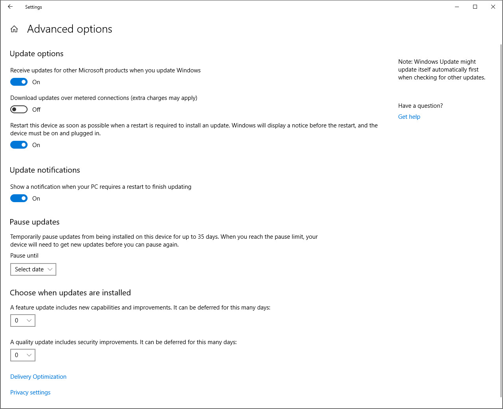
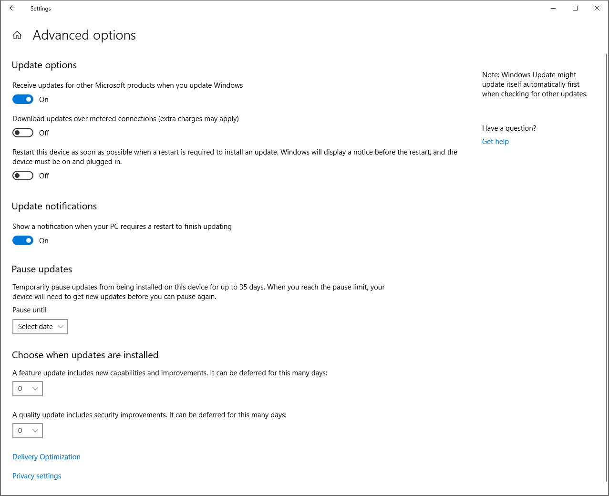
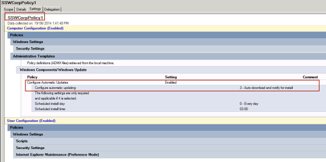

Microsoft Update is a service that allows for the periodic patching of system files to address known issues with Microsoft products. Originally called Windows Update, it was specifically focused on Operating System patches for Windows but has been expanded to include all Microsoft products and the name has changed to Microsoft Update, allowing the automated patching of non-OS software such as Internet Explorer and Microsoft Office.
 
It is important to keep your machine up-to-date, but Windows Update Automatic installation can be somewhat intrusive to your workflow. There is nothing worse than getting Windows Updates installing during an important presentation. You should set Windows Updates to be installed manually.

**Note:** This is only for client machines, Windows Update for Servers should be handled differently see: [Do you use Group Policy to manage your Windows Update Policy?](/_layouts/15/FIXUPREDIRECT.ASPX?WebId=3dfc0e07-e23a-4cbb-aac2-e778b71166a2&TermSetId=07da3ddf-0924-4cd2-a6d4-a4809ae20160&TermId=eb2f95c5-22c8-4568-9173-9e52e3087faf)

Go to     **Start**** | Windows Update Settings | Advanced Options **and set **Restart this device as soon as possible... **to **Off **and **Update Notifications **to **On.**

[[badExample]]
| 

[[goodExample]]
| 

If you have a system administrator who manages your organization’s infrastructure, it is recommended to get you system administrator to push this setting via group policy.

###  Related Rules

- 
- [Do you turn off auto-update on your servers?](/_layouts/15/FIXUPREDIRECT.ASPX?WebId=3dfc0e07-e23a-4cbb-aac2-e778b71166a2&TermSetId=07da3ddf-0924-4cd2-a6d4-a4809ae20160&TermId=3b0722be-c3e3-4369-a590-258c7501a67a) [for Servers]
- [Do you use Group Policy to manage your Windows Update Policy?](/_layouts/15/FIXUPREDIRECT.ASPX?WebId=3dfc0e07-e23a-4cbb-aac2-e778b71166a2&TermSetId=07da3ddf-0924-4cd2-a6d4-a4809ae20160&TermId=eb2f95c5-22c8-4568-9173-9e52e3087faf) [for both Servers and PCs]
