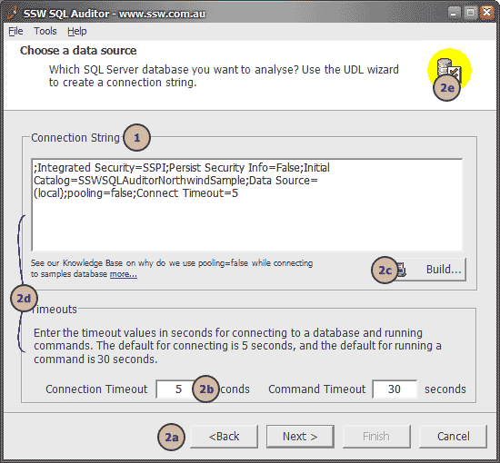
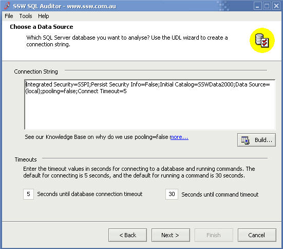
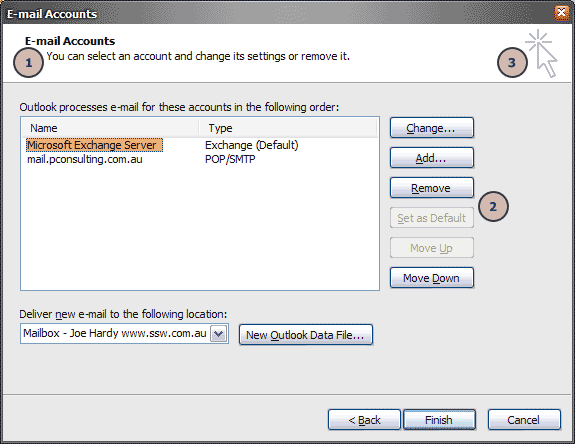

 
### Introduction

Despite seeming trivial, the most subtle elements of your form can have the greatest impact on your users.
 Figure: Bad Example - What's wrong with this form?
The form shown in this screenshot is an example of bad control placement:

1. The fonts used are non-standard (see:        [Do you use Microsoft's Recommended Font in your Application?](http://www.ssw.com.au/ssw/Standards/Rules/RulestoBetterInterfaces-Controls.aspx#Font))
2. The controls have        **no consistency**in terms of margins, spacing or even control alignment. See, for example:
    1. The navigation buttons at the bottom of the screen having uneven margin space on the right and bottom sides. They're also the wrong size.
    2. The dimensions of all input controls and buttons do not follow standard convention (see below)
    3. The right side of the "Build..." button is not aligned with the right of the "Connection String" text box
    4. The left margins inside the two frames are inconsistent.
    5. The space surrounding the logo in the top right corner is uneven

This detracts from the visual appeal of the user interface, and results in an uneven user experience. After looking at all of this you may be thinking "**do I really need to work out exactly what spacing and dimensions I want to use for every detail of a form I make?**"

The good news is that** you don't need to**: Microsoft have gone to a great deal of effort to     [define standards](http://www.ssw.com.au/ssw/Redirect/Microsoft/MSDNVisualDesign.htm) for exactly how your form controls should be laid out, and these standards are worth taking into consideration. By all means, if you have disagreements with anything listed here then please discuss it with us and we'll consider changing our own standards (Microsoft have changed theirs over the years, after all), but we recommend using the following as a guide.

These examples assume that you are using the standard system font as defined in the rule mentioned above. Please note that although Dialog Units (DLUs) are better suited for generic (font independent) use, they are not available in the Visual Studio designer.
Figure: Good Example - The form follows Standards of good form design discussed below
### The Rules

1. **Buttons must be...**
    - Spaced apart by 6 pixels from other buttons              **except** in the case of wizards where the              *< Back* and              *Next >* buttons may be closer together
    - Spaced 6 pixels from the inside border of a form on the sides closest to it
    - usually 75 pixels wide
    - 23 pixels high
2. **Single-line textboxes and most controls must be...**
    - 21 pixels high (width depends on content)
    - Aligned correctly with any related controls
3. **In a form...**
    - Margins must be consistent (see              [Microsoft's diagram illustrating this](http://www.ssw.com.au/ssw/Redirect/Microsoft/MSDNMargins.htm))

These are some of the more common examples. Please read Microsoft's     [Visual Design Guidelines](http://www.ssw.com.au/ssw/Redirect/Microsoft/MSDNLayout.htm) for more information and greater detail.

**Ultimately the goal of all of this is to ensure consistency**. Keeping these ideas in mind at all times while doing user interface design will give users a better overall experience and will boost the professionalism of your products.

### One From The Good Guys

Here's a good example for you to take inspiration from. This dialog is from Microsoft Outlook. Let's check out some points:

1. Consistency across wizard pages is very good
2. Spacing and sizing of buttons is precise
3. The logo has been positioned evenly

Figure: Good Example - Microsoft have defined to exacting measures what spacing should be used in their Microsoft Outlook wizards
Read more about control size on the     [Rules to Better Windows Forms](http://www.ssw.com.au/ssw/Standards/Rules/RulesToBetterWindowsForms.aspx#CommonControl) page

We have a program called     [SSW Code Auditor](http://www.ssw.com.au/ssw/CodeAuditor/Rules.aspx#SizeSpacing) to check for this rule.

