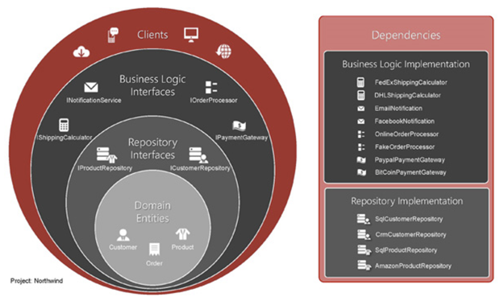
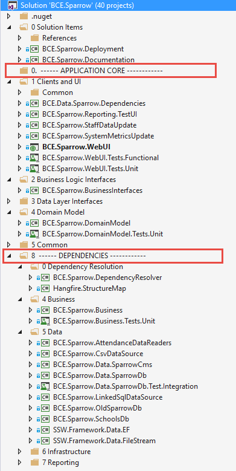

When developing software, we implement a [dependency injection centric architecture](/do-you-use-a-dependency-injection-centric-architecture).
 

[[goodExample]]
| 
Dependencies and the application core are clearly separated as per the     [Onion Architecture](/do-you-use-a-dependency-injection-centric-architecture).

In the above example you can clearly see:

- The different layers of the Onion Architecture: see        [Layers of the Onion Architecture](/do-you-know-the-layers-of-the-onion-architecture)
- Unit test and integration test projects: see[Rules to Better Unit Tests](http://www.ssw.com.au/ssw/standards/rules/RulesToBetterUnitTests.aspx)
- The Documentation solution folder: see        [Do you review the documentation?](/do-you-review-the-documentation)
- The References solution folder: to hold any 3rd party assemblies that are not available via NuGet

Common Library projects are named      **[Company].[AssemblyName]** . E.g.      **BCE.Logging** is a shared project between all solutions at company BCE.

Other projects are named      **[Company].[Solution Name].[AssemblyName]** . E.g.      **BCE.Sparrow.Business** is the Business layer assembly for company ‘BCE’, solution ‘Sparrow’.

We have separated the unit tests, one for each project, for several reasons:

- It provides a clear separation of concerns and allows each component to be individually tested
- The different libraries can be used on other projects with confidence as there are a set of tests around them

### Related rule

- [Do you know how to lay out your solution?](/do-you-know-how-to-lay-out-your-solution)
