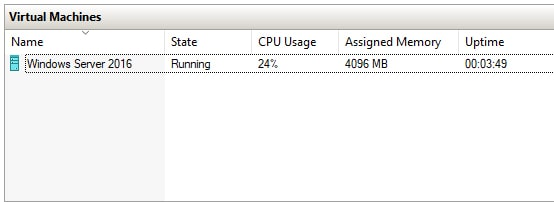
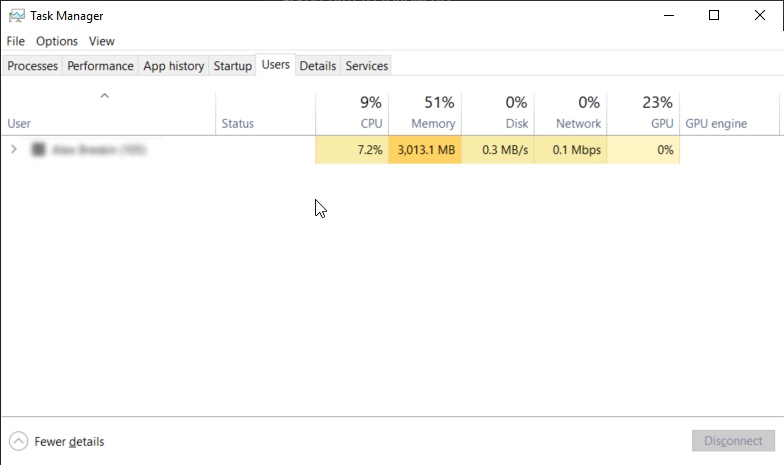
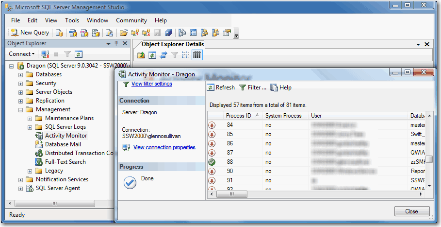

If your servers are down or have to go down during business hours you should notify the users at least 15 minutes beforehand so you will not get 101 people all asking you if the computer is down.

For short outages (under 15 minutes) that only affect only a few people (under 5 people), or are outside of business hours, then IM is the best method. If you use     [Teams or Skype](/_layouts/15/FIXUPREDIRECT.ASPX?WebId=3dfc0e07-e23a-4cbb-aac2-e778b71166a2&TermSetId=07da3ddf-0924-4cd2-a6d4-a4809ae20160&TermId=3a474efa-ca72-4320-af36-b0e6af355684) a quick message will do.

**Note:** If they are not online on Teams or Skype, then they can't complain that they were not warned.

For extended or planned outages, or if you have a larger number of users (50+),      **email**  is the suggested method.
 
### Email

If you send an email it is a good idea to tell the user a way to monitor the network themselves. Eg. Software solutions like SCOM or WhatsUp Gold.

Include a "[To myself](/_layouts/15/FIXUPREDIRECT.ASPX?WebId=3dfc0e07-e23a-4cbb-aac2-e778b71166a2&TermSetId=07da3ddf-0924-4cd2-a6d4-a4809ae20160&TermId=5c16d531-007d-49ef-8acc-b26596e13e84)". It gives visibility to others who are interested in what needs to be done to fix the problem and makes
it easier to remember to send the 'done' email. E.g. "done - CRM is alive again".

Example:
**To:** SSWALL
Hi All,        

Here is the summary of the outage plan:

| **Planned/Unplanned:**  | Planned |
| --- | --- |
| **Change Description:**  | Install Windows Updates and Restart Server  |
| **Risk (see table below):**  | LOW RISK (LOW Probability and MEDIUM Impact) |
| **Reason For Change:**  | Windows 2016 Windows Updates  |
| **Uptime over last month:**  | 91.361% |
| |   |
| **Planned Outage (mins):**  | 150 |
| **Planned Start Time:**  | 26 October 9:00 PM |
| **Planned Finish Time:**  | 26 October 11:30 PM  |
| |  |
| **Affected Services:**  | \\Windows Server 2016  |
| | http://sharepoint.ssw.com.au http://intranet.ssw.com.au http://projects.ssw.com.au |
| |   |

**Risk Lookup Table by Probability and Impact:** 

| **Risk**  |
| --- |
| | **Probability** |
| **Low** | **Medium** | **High** | **Unknown** |
| **Impact** | **Low** | Low risk | Low Risk | Low Risk | Medium Risk |
| **Medium** | Low Risk | Medium Risk | Medium Risk | High Risk |
| **High** | Medium Risk | High Risk | High Risk | High Risk |
| **Unknown** | Medium Risk                      | High Risk | High Risk | High Risk |

**Figure: Clearly showing the potential risks

** 
**Note:** The following servers will be affected

http://wug.ssw.com.au/

**To myself,** **
** To show others who are interested in what needs to be done to fix the problem:
 **Detailed Change Plan:** 
1)	Lockout users via IIS
2)	Backup server
3) Install Windows Updates 
4) Reboot server
5) Follow test plan
6) Based on result of test plan, follow backout plan if procedure failed
7) Procedure completed
**Test Plan:** 
1)	Check Event log for errors
2)	Check each affected service is running
3)	Call test users to start “Test Please” on the affect services 
4)	Get result of user “Test Please” by email by 11:15 PM
**Backout Plan:** 
1)	Restore server from backup

**Note:** [What is your server reboot/restart policy?](/_layouts/15/FIXUPREDIRECT.ASPX?WebId=3dfc0e07-e23a-4cbb-aac2-e778b71166a2&TermSetId=07da3ddf-0924-4cd2-a6d4-a4809ae20160&TermId=e3a456b4-3513-4dbe-a958-0176c1dfa85d) >

Immediately before the scheduled downtime, check for logged in users, file access, and database connections.

### Users

Open 'Windows Task Manager' (Run > taskmgr) and select the 'Users' tab. Check with users if they have active connections, then have them log off.

### Files

Open 'Computer Management' (Run > compmgmt.msc), then 'System Tools > Shared Folders'. Check 'Session' and 'Open Files' for user connections.

### Database

Open SQL Server Management Studio on the server. Connect to the local SQL Server. Expand 'Management' and double-click 'Activity Manager'.

Once these have been checked for active users, and users have logged off, maintenance can be carried out.

**Restarts should only be performed during the following time periods**

1. Between 7am and 7:05am
2. Between 1pm and 1:05pm
3. Between 7pm and 7:05pm  

If a scheduled shutdown is required, use the PsShutdown utility from [Microsoft's Sys Internals](https://www.ssw.com.au/ssw/Redirect/Microsoft/Technet.htm) page.

**Always reply 'Done' when you finish the task.**
