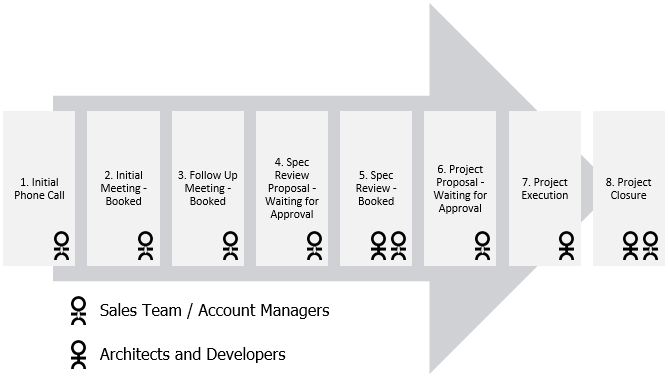

Having a documented process for managing engagements provides clients with a consistent experience. It also helps to get new employees up to speed quickly, and provides a reference to existing employees to ensure no steps are accidentally missed. 

Our engagement lifecycle overlaps with our     [sales pipeline](/do-you-know-the-6-stages-in-the-sales-pipeline), and maps to the     [8 Steps to Scrum](/do-you-know-the-8-steps-to-scrum).

[[goodExample]]
| 

1. Initial Phone Call
    - The client has made contact but no initial meeting has yet been made
2. [Initial Meeting](/meetings-are-you-prepared-for-the-initial-meeting) - Booked
    - Sales team has arranged an initial meeting and it's booked in.
    - The Initial Meeting is a non-billed meeting that maps to the Initial Meeting described in the           [8 Steps to Scrum](/do-you-know-the-8-steps-to-scrum). It is attended by a Sales person and ideally a Solution Architect.
3. Follow Up Meeting - Booked
    - In some cases, more than one initial meeting may be required before work or speccing commences.
4. [Specification Review](/rules) Proposal - Waiting for Approval
    - After the Initial Meeting, if the work requires it, a specification review is proposed.
5. Specification Review - Booked
    - The Specification Review meeting has been approved and booked in.
    - The Specification Review is a billed meeting with the customer to review existing specifications, understand specific goals, risks and relevant technologies appropriate for the solution, and create the initial backlog.
    - During the Specification Review, the Solution Architect prepares a document, presentation, or video outlining the results of the Specification Review, as per [Spec - Do you effectively present the outcomes at the "Specification Review Presentation"?](/spec-do-you-effectively-present-the-outcomes-at-the-＂specification-review-presentation＂).
6. Project Proposal - Waiting for Approval
    - After the Specification Review, the client is given a proposal for a chunk of work. Once this is approved, the Sales Team closes the opportunity as 'won'.
    - Proposal is sent to the client including financials and the result of the Specification Review.
7. Project Execution
    - The           [Scrum](/do-you-know-the-8-steps-to-scrum) process runs, starting with the first sprint forecast email, as per           [Do you create a Sprint Forecast? (aka The functionality that will be developed during the Sprint)](/do-you-create-a-sprint-forecast-%28aka-the-functionality-that-will-be-developed-during-the-sprint%29).
8. Project Closure
    - Project is completed, any handover or other transition that has been defined is completed with the client.
    - Just like a Sprint Retrospective is held at the end of each Sprint, a Project Retrospective is held to learn from the project that has just completed.
