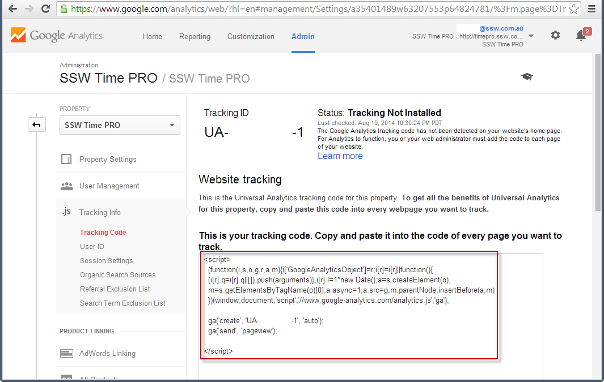

Google Analytics gives you a great insight into how, when and where your website is used. If you're not using an analytics package in your website, you're flying blind when it comes to understanding how, when and where your website is used.

<!--endintro-->

By using Google Analytics, you will be able to see what your visitors are viewing and what they aren't, what they spend large amount's of time on, what pages are causing errors, what pages are directing visitors to you, which browsers and devices are being used to see you site and more. All this information help you better structure your site to what your visitors like. It also allows you to compare site traffic from one month to another.

The most useful reports:

* Which are your most popular pages of your website
* Which sites are referring the most hits to you
* Which keywords are bringing users to your site
* If you have downloads, which are the most popular

To add Google Analytics to your website, [log into your Google account](https://www.google.com/analytics), then go to **Admin** , ensure both **Account**  and **Property**  specify your website, then find your **Tracking Code** .
.png)Figure: Navigate to the Tracking Code property
From this page, you will be able to get a JavaScript snippet to include in your application.

 
Once deployed, this script will start tracking metrics and interacting with Google Analytics. You are good to go!
