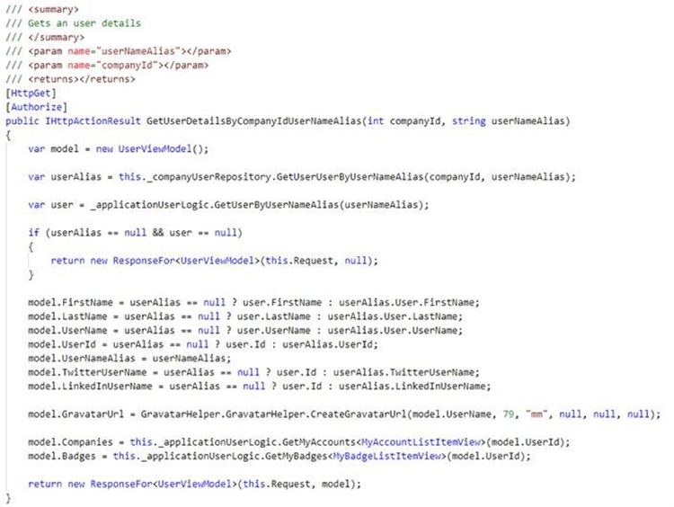

It's common for business logic to be added directly to the presentation layer. When building ASP.NET MVC systems, this typically means that business logic is added to controllers as per the following example:
 
The logic in the above controller cannot be reused, for example, by a new console application. This might be fine for trivial or small systems but would be a mistake for enterprise systems. It is important to ensure that logic such as this is independent of the UI so that the system will be easy to maintain now and well into the future. A great approach to solving this problem is to use the mediator pattern with CQRS.

CQRS stands for Command Query Responsibility Segregation. It's a pattern that I first heard described by Greg Young. At its heart is the notion that you can use a different model to update information than the model you use to read information
...
There's room for considerable variation here. The in-memory models may share the same database, in which case the database acts as the communication between the two models. However they may also use separate databases, effectively making the query-side's database into a real-time reporting database.
**Martin Fowler** - https://martinfowler.com/bliki/CQRS.html

CQRS means clear separation between Commands (Write operations) and Queries (Read operations).
CQRS can be used with complex architectures such as Event Sourcing but the concepts can also be applied to simpler applications with a single database.

MediatR is an open source .NET library by Jimmy Bogard that provides an elegant and powerful approach for writing CQRS, making it easier to write clean code.

For every command or query, you create a specific request class that explicitly defines the “input” required to invoke the operation.

Then the implementation of that command or query is implemented in a handler class. The handler class is instantiated by a Dependency Injection container – so can use any of the configured dependencies (Repositories, Entity Framework, services etc).

This approach brings many benefits:

- Each command or query represents an atomic, well-defined operation such as "Get My Order Details" (Query) or "Add Product X to My Order" (Command)
- In Web APIs, this encourages developers to keep logic out of controllers. The role of controllers becomes reduced to "Receive a request from the web and immediately dispatch to MediatR". This helps implement the "Thin controllers" rule:  https://rules.ssw.com.au/do-you-use-thin-controllers-fat-models-and-dumb-views. When logic is in a controller, the only way to invoke it is via web requests. Logic in a mediator handler can be invoked by any process that is able to build the appropriate request object, such as background workers, console programs or SignalR hubs
- Mediator also provides a simple pub/sub system allowing "side effects" to be explicitly implemented as additional, separate handlers. This is great for related or event-driven operations such as "Update the search index after a change to the product has been saved to database"
- Using a specific handler class for each operation means that there is a specific dependency configuration for each command or query
- Developers often implement interfaces and abstractions between the layers of their applications. Examples of this might include an IMessageService for sending emails or an IRepository interface to abstract database access. These techniques abstract specific external dependencies such as "How to save an order entity in the database" or "How to send an email message". We have witnessed many applications with clean, persistence-ignorant repository layers but then with messy spaghetti code on top for the actual business logic operations. MediatR commands and queries are better at abstracting and orchestrating higher-level operations such as "Complete my order" that may or may not use lower-level abstractions. Adopting MediatR encourages clean code from the top down and help developers "fall into the pit of success"
- Building even a simple app with this approach makes it easy to consider more advanced architectures such as event sourcing. You have clearly defined "What data can I get" and "What operations can I perform". You are then free to iterate on the best implementation to deliver the defined operations. MediatR handlers are easy to mock and unit test
- MediatR handlers are easy to mock and unit test
- The interface for MediatR handlers encourages the implementation of best-practice async methods with cancellation token support.
- MediatR introduces a pipeline behaviour system allowing custom to be injected around handler invocation. This is useful for implementing cross-cutting concerns such as logging, validation or caching

