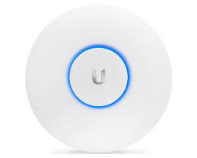
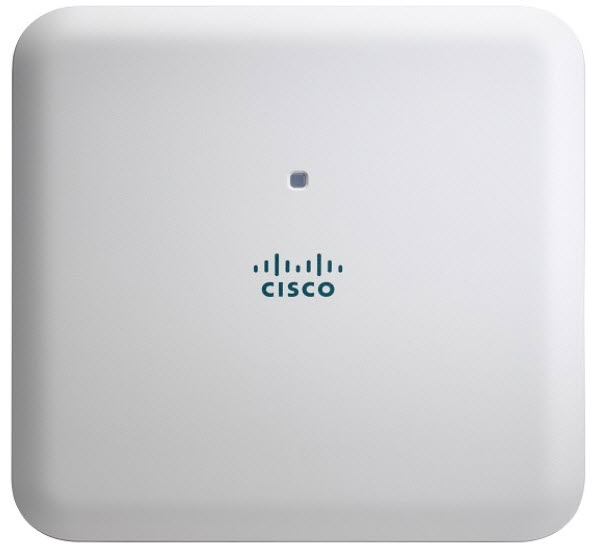
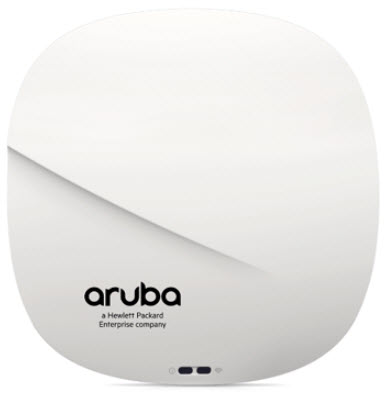

When purchasing new network hardware you should always choose the most reliable option.

At SSW, we have discovered that:
 
### Firewalls

**1** **. Cisco ASA is the best.** Cisco has built a lot of trust and a large community of backers over the years by providing an extremely solid product. Finding support and assistance with Cisco devices is much easier than most vendors due to the sheer size of the community. Also pushing it to the lead are advanced features like:

- MalWare Protection
- Application Control
- FirePOWER Threat Defence
- Centralised Firewall Management Center

**

**

**2. pfSense is the second best.** One of the most used firewalls and for good reason. This Open Source firewall offers similar features to the leading providers of firewalls but comes in at a fraction of the price since the software is free and only requires you to purchase the hardware to run it. This gives you the ability to have an extremely good firewall at a fraction of the price.

### Switches

**1. HPE is the best.** HPE Switches now rebranded as Aruba Switches have provided a strong product for many years. The feature that really pushes this ahead of the game is the reliability of the hardware as well as a lifetime warranty on hardware with next day replacement at no additional cost.

**2. Cisco is the second best.** A leading product for many years however comes at a much larger cost than HPE/Aruba and usually contains ongoing license fees for support. But is a very reliable and feature rich product.

### Access Points

**1. Ubiquity is the best.** Quickly becoming the leading AP used in the industry it offers a rich cloud management software allowing ease of management over multiple sites and countries. Unifi Access Points are easy to manage and install and can be upgraded and provisioned with the touch of a button. With new features being released regularly and prices much lower than Cisco and Aruba it is hard to not see why this is the best.

**2.** **Cisco/Aruba is the second best.** Offering many features and used on many large projects such as the University of Wollongong for Cisco and KFC for Aruba they offer truly tried and tested hardware. These products do come at a higher cost and requires a lot more skill and time to manage and really only come into the spotlight on large scale projects.

