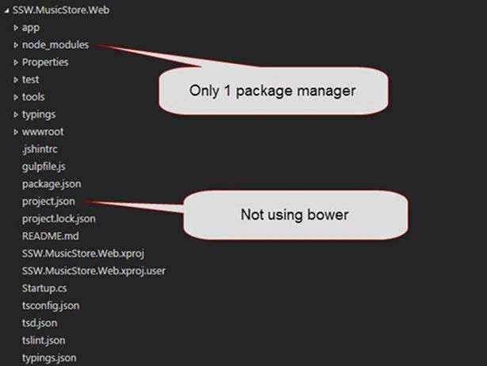

When creating NuGet packages, it is better to create few small packages instead of creating one monolithic package that combines several relatively independent features.  
When you are making a decision to package your reusable code and publish it to      **NuGet**  sometimes it is worths splitting your package into few smaller packages. This will improve maintainability and transparency of your package. It will also make it much easier to consume and contribute to.

Lets assume you have created a set of libraries that add extra functionality to web applications. Some libraries classes work with both      **ASP.NET MVC**  and      **ASP.NET WebForms**  projects, some are specific to ASP.NET MVC and some are related to security. Each library may also have external dependencies on some other NuGet packages. One way to package your libraries would be to create a single YourCompany.WebExtensions package and publish it to NuGet. Sounds like a great idea, but it has number of issues. What if someone only wants to use some MVC specific classes from your package, they would still have to add your whole package, which will add some other external dependencies that you will never use.

A better approach would be to split your libraries into 3 separate packages:  **YourCompany.WebExtensions**  **.Core** ,  **YourCompany.WebExtensions**  **.MVC** and  **YourCompany.WebExtensions**  **.Security** .  **YourCompany.WebExtensions**  **.Core**  will only contain core libraries that can be used in both ASP.NET WebForm and MVC.  **YourCompany.WebExtensions**  **.MVC**  package will contain only MVC specific code and will have a dependency on the Core package.  **YourCompany.WebExtensions**  **.Security**  will only contain classes that are related to security. This will give consumer a choice as well as better transparency to the features you are trying to offer. It will also have a better maintainabilty, as one team can work on one package while you are working on another one. Patches and enhancements can also be introduced much easier.

[[badExample]]
| 
[[goodExample]]
| 
