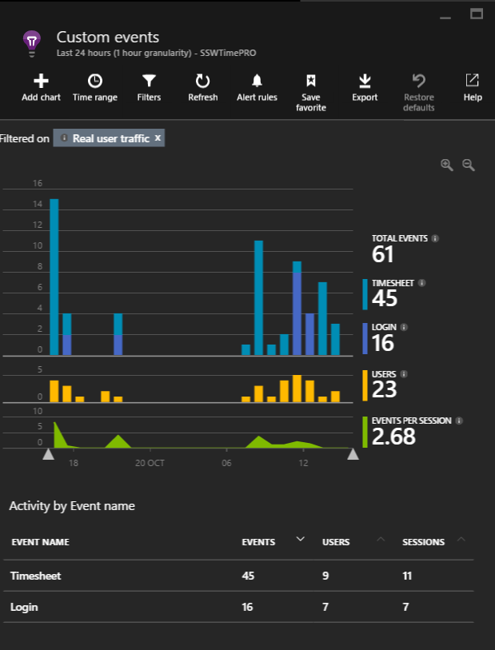
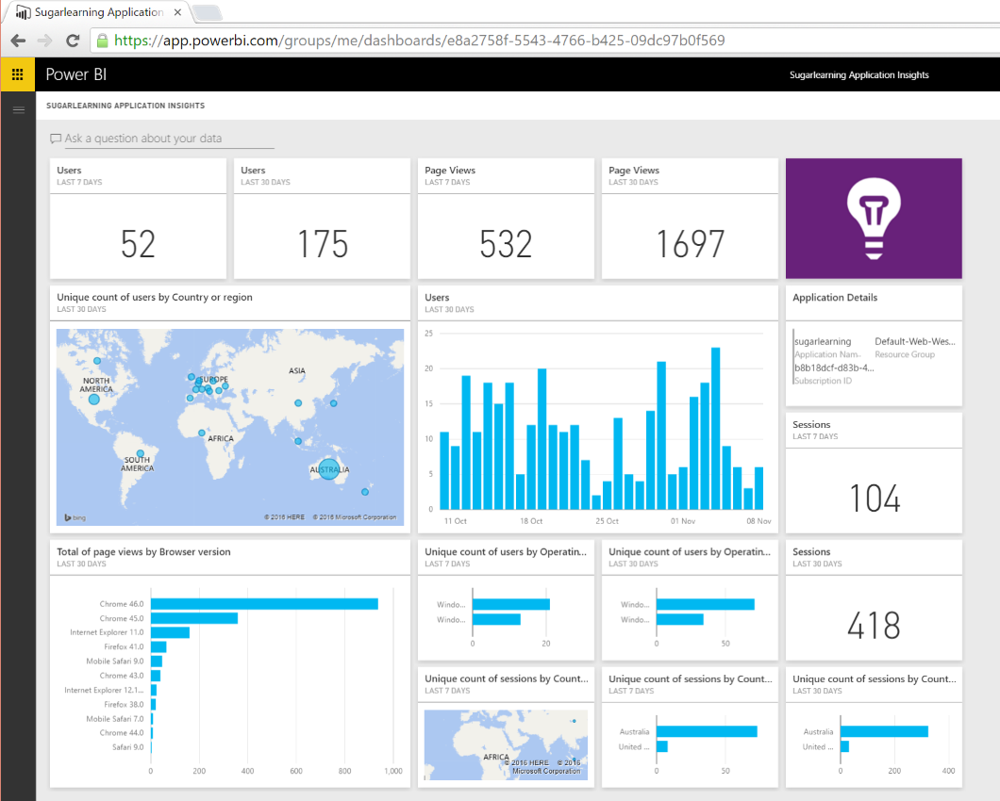
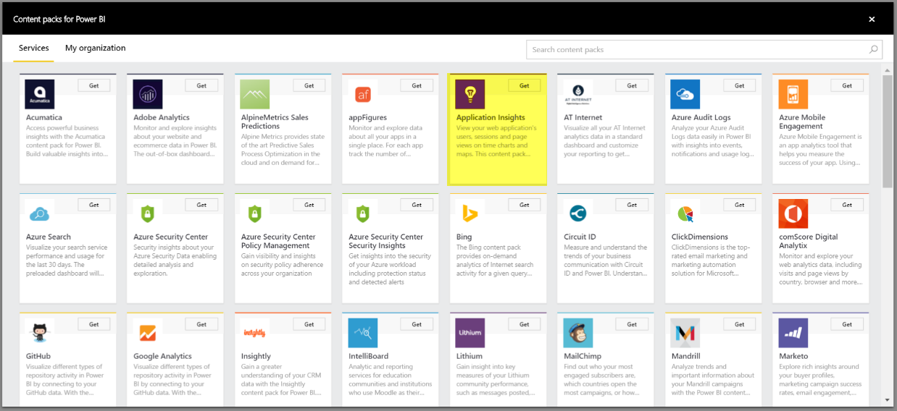

 
You've set up your Application Insights as per the rule 'Do you know how to set up Application Insights.

Your daily failed requests are down to zero & You've tightened up any major performance problems.​​

Now you will discover that understanding your users' usage within your app is child's play.
 
The Application Insights provides devs with two different levels of usage tracking. The first is provided out of the box, made up of the user, session, and page view data. However, it is more useful to set up custom telemetry, which enables you to track users effectively as they move through your app.
  Figure: The most frequent event is someone filling out their timesheet.
It is very straightforward to add these to an application by adding a few lines of code to the hot points of your app. Follow this link to read more (https://azure.microsoft.com/en-us/documentation/articles/app-insights-api-custom-events-metrics/).

Feel constricted by the Application Insights custom events blade? Then you can export your data and display it in PowerBI in a number of interesting ways.
  Figure: Power BI creates an easy to use and in-depth dashboard for viewing the health of the application 

Previously we would have had to perform a complicated set up to allow Application Insights and Power BI to communicate. [(Follow this link to learn more).](http://blog.chrisbriggsy.com/Getting-Started-using-Application-Insights-PowerBI/) Now it is as easy as adding the Application Insights content pack.    Figure: Content packs make it simple to interact and pull data from third-party services

