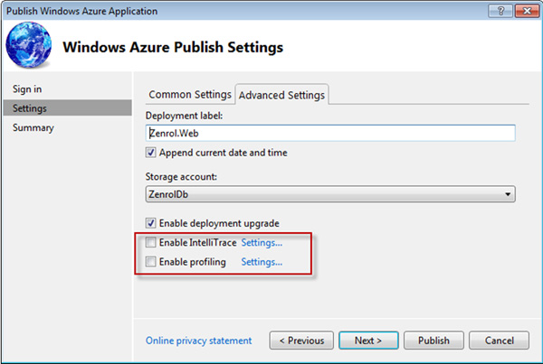

 Azure transactions are CHEAP. You get tens of thousands for just a few cents. What is dangerous though is that it is very easy to have your application generate hundreds of thousands of transactions a day. 
Every call to Windows Azure Blobs, Tables and Queues count as 1 transaction. Windows Azure diagnostic logs, performance counters, trace statements and IIS logs are written to Table Storage or Blob Storage.

If you are unaware of this, it can quickly add up and either burn through your free trial account, or even create a large unexpected bill.

**Note:** Azure Storage Transactions do not count calls to SQL Azure.

## Ensure that Diagnostics are Disabled for your web and worker roles

Having Diagnostics enabled can contribute 25 transactions per minute, this is 36,000 transactions per day.

Question for Microsoft: Is this per Web Role?
Figure: Check the properties of your web and worker role configuration filesFigure: Disable diagnostics
## Disable IntelliTrace and Profiling
Figure: When publishing, ensure that IntelliTrace and Profiling are both disabled
## Robots.txt 

Search bots crawling your site to index it will lead to a lot of transactions. Especially for web "applications" that do not need to be searchable, use Robot.txt to save transactions.
Figure: Place robots.txt in the root of your site to control search engine indexing
## Continuous Deployment

When deploying to Azure, the deployment package is loaded into the Storage Account. This will also contribute to the transaction count.

If you have enabled continuous deployment to Azure, you will need to monitor your transaction usage carefully.

### References

- [Understanding Windows Azure Storage Billing – Bandwidth, Transactions, and Capacity](http://blogs.msdn.com/b/windowsazurestorage/archive/2010/07/09/understanding-windows-azure-storage-billing-bandwidth-transactions-and-capacity.aspx%20target=)
- [Does Windows Azure hosted service use storage transactions](http://serverfault.com/questions/363803/does-windows-azure-hosted-service-use-storage-transactions%20target=)

