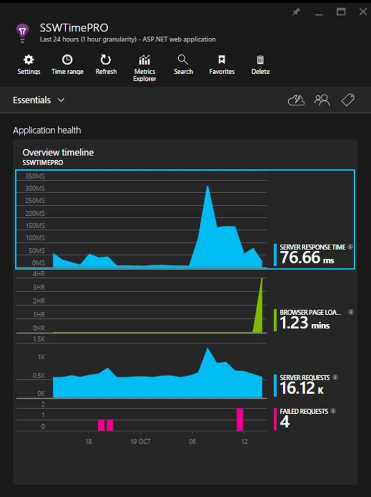
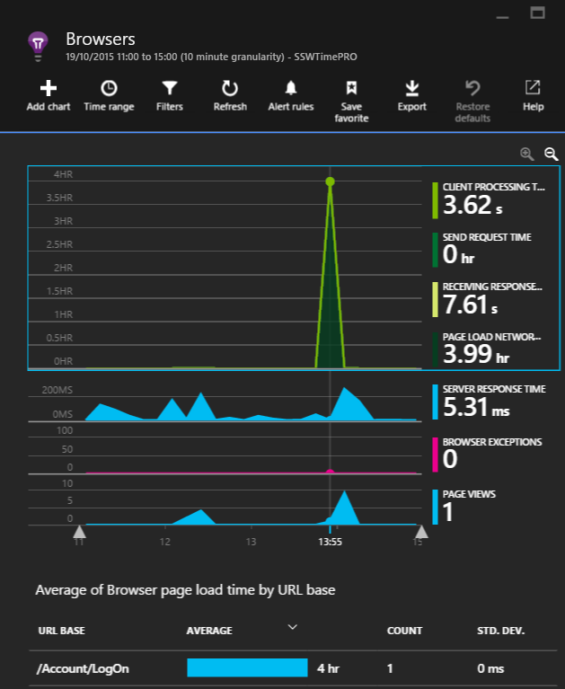
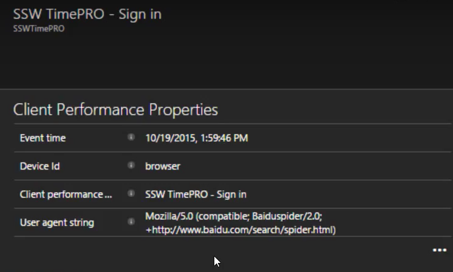
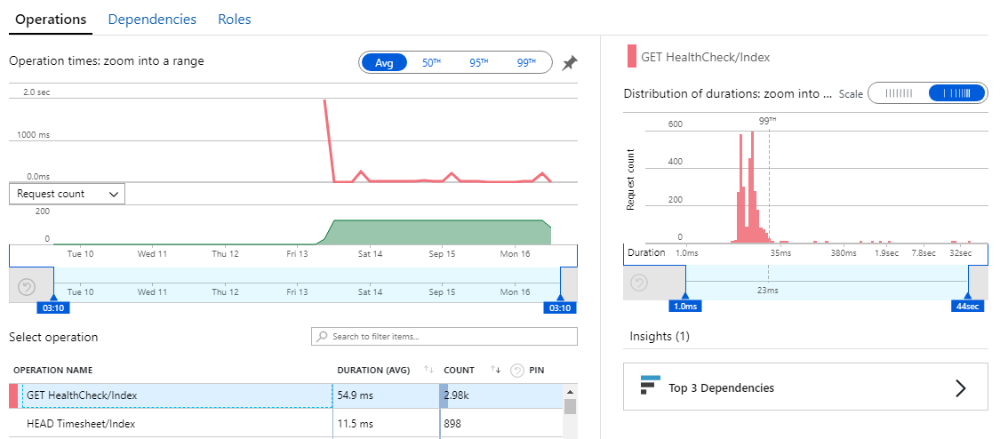

Once you have set up your Application Insights as per the rule 'Do you know how to set up Application Insights' and you have your daily failed requests down to zero, you can start looking for performance problems. You will discover that uncovering your performance related problems are relatively straightforward.
 
The main focus of the first blade is the 'Overview timeline' chart, which gives you a birds eye view of the health of your application.

(one on each graph), but which is the most important? Hint: look at the scales!

Developers can see the following insights:

- Number of requests to the server and how many have failed (First blue graph)
- The breakdown of your page load times (Green Graph)
- How the application is scaling under different load types over a given period
- When your key usage peaks occur

Always investigate the spikes first, notice how the two blue ones line up? That should be investigated, however, notice that the green peak is actually at  **4 hours.**  This is definitely the first thing we'll look at.

As we can see that a single request took four hours in the 'Average of Browser page load time by URL base' graph, it is important to examine this request.

It would be nice to see the prior week for comparison, however, we're unable to in this section.

(a Chinese search engine) got stuck and failed to index the page.
**At this point, we'll create a PBI to investigate the problem and fix it.**

(Suggestion to Microsoft, please allow annotating the graph to say we've investigated the spike)

The other spike which requires investigation is in the server response times. To investigate it, click on the blue spike. This will open the Server response blade that allows you to compare the current server performance metrics to the previous weeks.

In this view, we find performance related issues when the usage graph shows similarities to the previous week but the response times are higher. When this occurs, click and drag on the timeline to select the spike and then click the magnifying glass to ‘zoom in’. This will reload the ‘Average of Server response time by Operation name’ graph with only data for the selected period.

### Looking beyond the Average Response Times

High average response times are easy to find and indicate an endpoint that is usually slow - so this is a good metric to start with. But sometimes a low average value can contain many successful fast requests hiding a few much slower requests.

Application insights plots out the distribution of response time values  allowing potential issues to be spotted.

!
