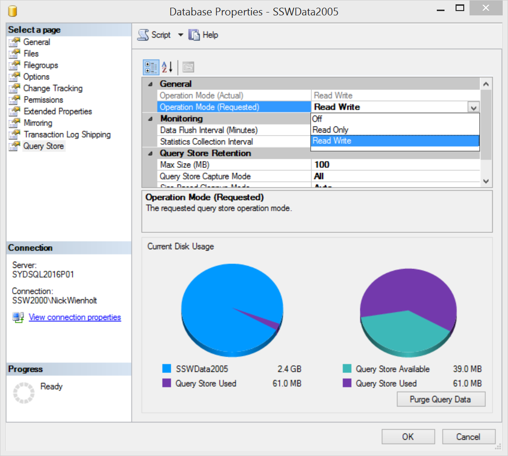
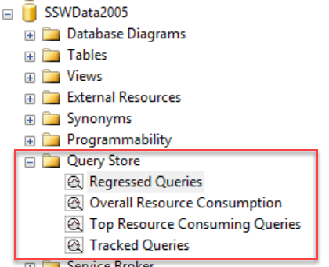
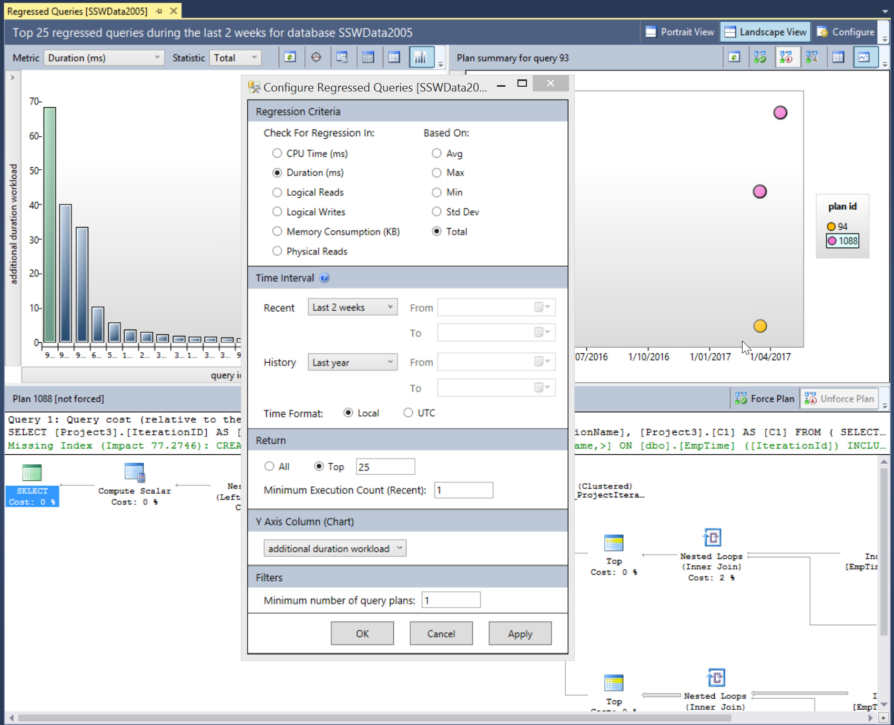
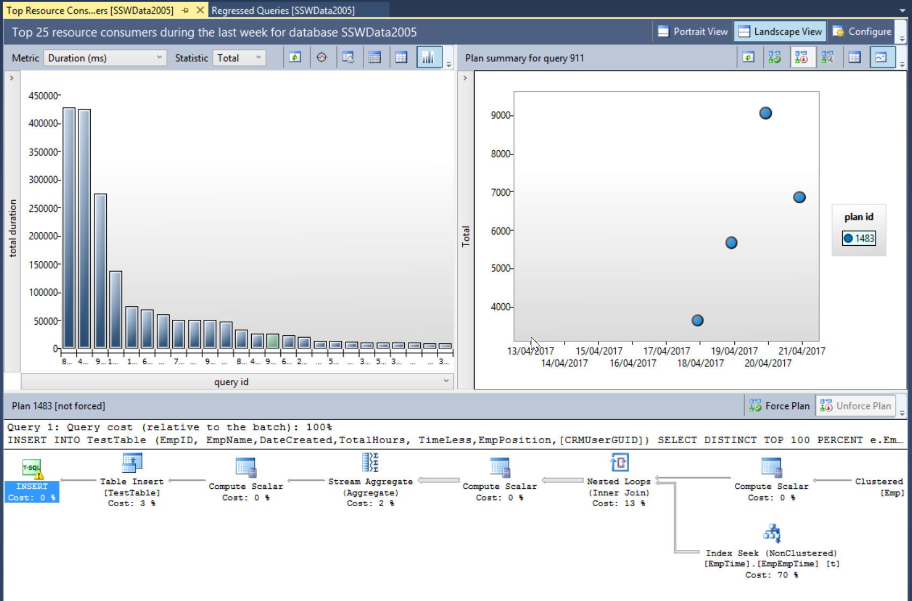

Working out why the performance of an application has suddenly degraded can be hard.  This rule covers some investigations steps that can help determine the cause of performance problems.
 
### 1. Use Application Insights to determine when the application last had acceptable performance 

Follow the [Do you know how to find performance problems with Application Insights?](/_layouts/15/FIXUPREDIRECT.ASPX?WebId=3dfc0e07-e23a-4cbb-aac2-e778b71166a2&TermSetId=07da3ddf-0924-4cd2-a6d4-a4809ae20160&TermId=ee100854-c5a4-44fd-ae5e-1d3a825ca4fe) rule to determine when the decrease in performance began to occur. It's important to determine if the performance degradation occurred gradually or if there was a dramatic drop-off in performance.

### 2. Look for changes that coincide with the performance issue

There are three general cases that can cause performance issues:

1. A change to software or hardware.  Your deployment tool (such as Octopus) can tell you if there has been a software deployment, and you can work with your network admin to determine if there has been infrastructure changes.
2. The load factor on the application can change.  Application Insights can help you determine if the load factor on the application has increased.
3. A hardware issue or network issue can occur that interferes with normal operation.  The Windows Event Log and other sys admin monitoring tools can alert you to infrastructure issues like this.

### 3. Dealing With Code Related Issues

If a software release has caused the performance problems, it is important to work out the code delta between the software release that worked well and the new release with the performance issues.  Your software repository should have the necessary metadata to allow you to trace code deltas between release numbers.  Inspect all the changes that have occurred for obvious performance issues like bad EF code, unnecessary loops and chatty network calls.  See [Do you know where bottlenecks can happen?](/_layouts/15/FIXUPREDIRECT.ASPX?WebId=3dfc0e07-e23a-4cbb-aac2-e778b71166a2&TermSetId=07da3ddf-0924-4cd2-a6d4-a4809ae20160&TermId=9d3e03da-fb33-499f-84c7-04976d866b5b) for more information on performance issues that can be introduced with code changes.

### 4. Dealing with Database Related Issues

Application Insights can help determine which tier of an application is performing poorly, and if it is determined that the performance issue is occurring in the database, SQL Server makes finding these performance issues much easier.

**Tip:** Azure SQL can provide performance recommendations based off your application usage and even automatically apply them for you.

Query Store is like having a light-weight version of SQL Profiler running all the time, and is enabled at a database level using the Database Properties dialog:

Once Query Store has been enabled for a particular database, it needs to run for a number of days to collect performance data.  It is generally a good idea to enable Query Store for important production databases     **before** performance problems occur.  Detailed information on regressed queries, overall resource consumption, the worst performing queries, and detailed information such as query plans for a specific SQL statement can then be retrieved using SQL Server Management Studio (SSMS).

Once Query Store has been collecting performance information on a database for an extended period, a rich collection of information is available.  It is possible to show regressed queries by comparing a Recent time interval (2 weeks in the diagram below) compared to a baseline History period (the Last Year in the diagram below) to see queries that have begun to perform poorly.

In the diagram we can see the total duration for a query (top left), the execution plans that have been used on a particular query (top right) and the details of a selected execution plan in the bottom pane.  The actual SQL statement that was executed is also visible, allowing the query to be linked back to a particular EF code statement.

The Top Resource Consuming Queries tab is extremely valuable for performance tuning a database.  You can see the Top 25 Queries by:

- Duration
- CPU Time
- Execution Count
- Logical Reads
- Logical Writes
- Memory consumption
- Physical Reads

All of these readings can be broken down using the  statistical measures of:

- Total
- Average
- Min
- Max
- Std Deviation

As with the Regressed Queries tab, the query plan history and details of a particular query plan are available for inspection. This provides all the required information to track down the part of the application that is calling the poorly performing SQL, and also provides insight into how to fix the poor performance depending on which SQL step is taking the most time.

