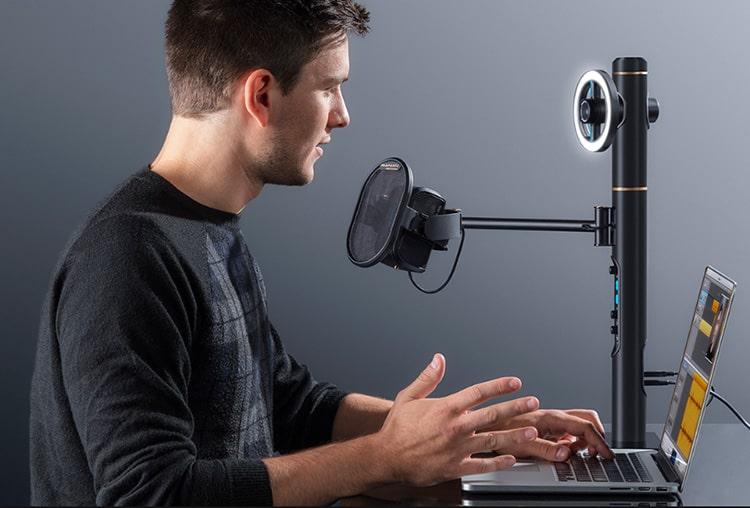
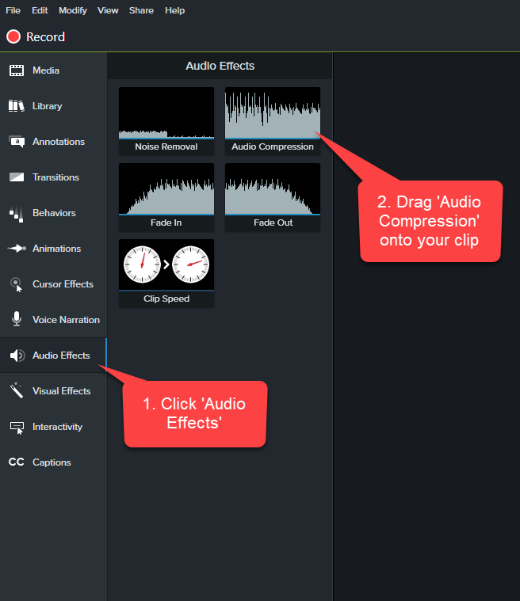
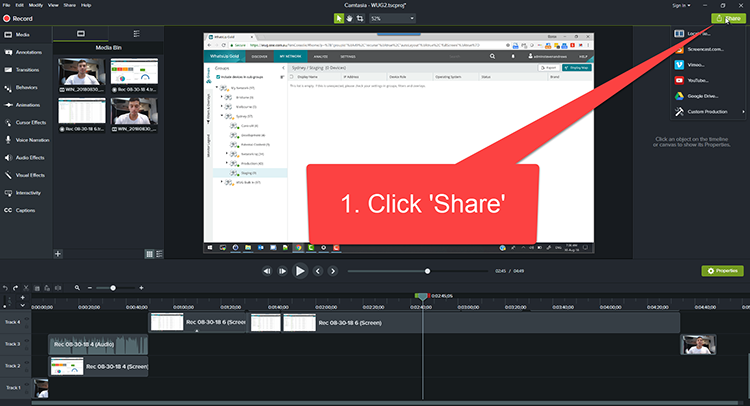
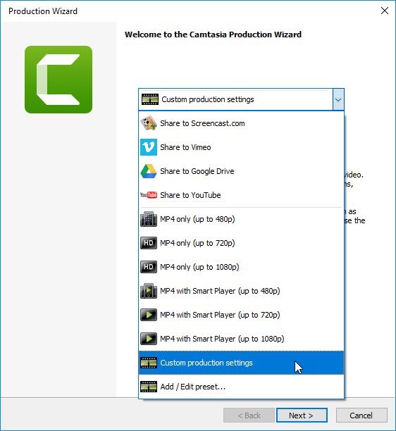
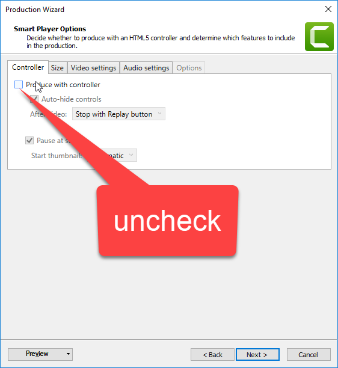
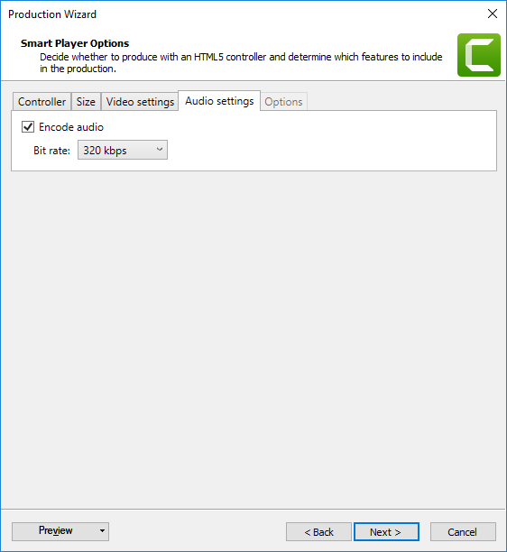

When you've finished a PBI you should record a video to send to your Product Owner and anyone else that is interested. A 'Done' video is much better than a screenshot because you are proving the PBI workflow actually works. Even better, this video can double as documentation or release notes for your users.
 
When deciding whether a PBI might be a good contender to record a done video for, consider these factors:

1. Is it a key piece of functionality that has high business value?
2. Would it be difficult to quickly demo in the Sprint Review without a video?
3. Is it UI heavy? i.e. would the video be compelling?

Here's a quick video describing how to record and edit a quick done video. (Notice how it itself is also in the done video format?)

`youtube: https://www.youtube.com/embed/CjwkGk1LcJ0`
 

**Figure: How to make a 'Done Video'**
**
**
**
**

**For a great 'Done Video' here are the key things to remember:
**

- Don't just demonstrate your new feature, start by showing the problem you are solving and the pain of why you needed to add the feature
- Record it in one take. It doesn't matter if you stuff up or something goes wrong, treat it like you're having a conversation with them in the room. If it's super bad, just start again.
- It's supposed to be quick and easy to make. If you spend too much time, you will be less likely to want to do it again in the future.
- Be quick and concise, you don't want to waste other peoples' time either!
- In your browser, remember to hide visible bookmark bars, browser tabs, add-in icons, and taskbar items to make it easier to view.
- See Rule: [Do you make sure your screen recordings are easy to view?](/_layouts/15/FIXUPREDIRECT.ASPX?WebId=3dfc0e07-e23a-4cbb-aac2-e778b71166a2&TermSetId=07da3ddf-0924-4cd2-a6d4-a4809ae20160&TermId=d6c8ec14-f604-490a-a96a-82315794cd6b)
- In your browser, such as Chrome then you should first zoom to 125% ideally.
- See Rule: [Do you always zoom in when using a projector?](/_layouts/15/FIXUPREDIRECT.ASPX?WebId=3dfc0e07-e23a-4cbb-aac2-e778b71166a2&TermSetId=07da3ddf-0924-4cd2-a6d4-a4809ae20160&TermId=01b38f0f-597f-4410-84de-465a705aabea)  (or in this case before the recording a 'Done' video)
- You want it readable on a mobile phone so record at 1920x1080 (aka 1080p). This gives the best balance of detail to size, for smaller screens.
- Use zoom.us as the screen capture software.
- Don't edit the video, Don't edit the video, just include your face at the beginning and end, using the fading functionality.
**Tip:** If you are using Zoom you do not need to edit the video. Zoom includes your face automatically in the screen capture. Awesome!
- **Remember**: smile at the beginning and end of the video!

**Tip: **Some offices have a professional setup.
E.g. SSW have the                 **Marantz Turret** hardware and desktop recording kit. The Turret is an ideal device to record these videos as it has a professional podcasting microphone, built-in light and good quality High Definition video camera.

[Product Review: The Marantz Turret — Wistia](https://wistia.com/learn/production/marantz-turret-review?wvideo=whmpjct7xj)

### Camtasia - Let's look at an example by Ben Cull

E.g. SSW TimePRO - Power BI Ad-Hoc Reporting:

`youtube: https://www.youtube.com/embed/nG4IAxdEWQg`

**Figure: A real example of a 'Done Video' with Fades**

### Tip: Fix the audio before making any cuts to the video

After recording your video, you need to do some basic sound processing to make the audio awesome.

- In the Timeline, select the clip with the audio
- On the top left panel, click ‘Audio Effects’ and drag the ‘Levelling’ effect onto your clip
- On the timeline, move the new audio meter up just until the audio waveform is about to hit the top
- Listen and adjust as necessary

### Tip: Camtasia 9 - How to fade-out and fade-in the video track of your face in Camtasia 9

1. With the video track of your face selected, click on **Animations (1)**. Track 3 in the image below.
2. Select the **No Opacity (2)  **animation effect for the fade-out.
3. **Drag and drop the No Opacity effect (3)** to the point in the track where you want to fade-out. Adjust the start and end point of the fade using the handles on the animation arrow.
4. Select the **Full Opacity (4) **animation effect for fade-in.
5. **Drag and drop the Full Opacity effect (5) ** to the point in the track where you want to fade-in. Adjust the start  and end point of the fade using the handles on the animation arrow.

###  Final Step – Export your video  

Follow the steps to export your video:

1. Click the Share button on the top right of the window

2. In the new dialog, select custom production settings                       

3. In the next window, uncheck the ‘Produce with controller’ option                       

4. In the ‘Video settings’ tab, copy these settings:
-	Frame Rate: 30
-	H.264 Profile: High
-	Encoding mode: Quality
    o	Increase the quality to 100%                       

5. In the ‘Audio settings’ tab, make sure the Bit rate is set to 320 kbps                       

6. Click Next and save your file!

### Related rule

- [Communication - Do you send "Done Videos"?](/_layouts/15/FIXUPREDIRECT.ASPX?WebId=3dfc0e07-e23a-4cbb-aac2-e778b71166a2&TermSetId=07da3ddf-0924-4cd2-a6d4-a4809ae20160&TermId=f5fc27ce-af9d-4b57-ad64-3893dacc09e3)
