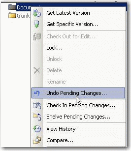
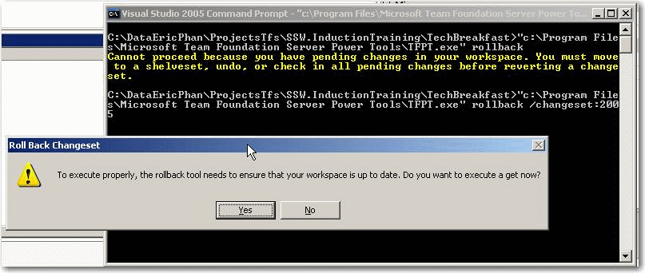

This field should not be null (Remove me when you edit this field). 
There are two ways to do this:1. If you haven’t checked in any files since you started modifying them then the process is simple:
    - Right click your solution and  **Undo Pending Changes** 

2. If you aren’t so lucky and have made some commits along the way then the only option is to use the Rollback command.
    - To use this you will need to install [Team Foundation Server Power Tools v1.2](http://www.ssw.com.au/ssw/Redirect/TFSPowerToolsDownload.htm) 

    - Find the revision before you started checking code in using the  **History command** 

    - Open the Command Prompt in your current working directory and type  **“c:\Program Files\Microsoft Team Foundation Server Power Tools\tfpt.exe” rollback /changeset:5367** 

    - Click  **Yes**  and the rollback will proceed

It would be nice if there was a GUI for this tool so that I can just right click and select rollback. See [Better Software Suggestion – TFS](http://www.ssw.com.au/ssw/Standards/BetterSoftwareSuggestions/TeamFoundationServer.aspx#RollbackGUI)
