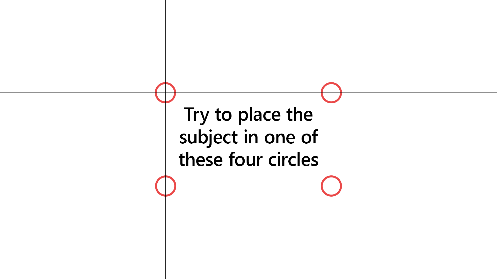

Taking photos can be difficult when you don’t have a 24h available photographer. 

So, don’t discourage your team members that don't have the right skills to keep sharing photos with your Marketing team. Instead, we asked some hot photography tips from the SSW TV team to help you out.

 

Here they are:

- **Framing:**  Being eye level with the subject and using the rule of thirds, which involves mentally dividing up your framing using 2 horizontal lines and 2 vertical lines, as a professional camera would do – if you are not using one. Also make sure there isn’t too much empty space and that you are not missing anyone important, if you have a big group, for example.

- **Composition Checklist:**
        - What is in your photograph? Is it well-positioned?
        - Is the desk clean?
        - Are there things that shouldn’t be in the photograph? E.g. confidential information
        - Lighting: Get the most out of lighting, especially if you are taking indoor photos. Try to avoid taking photos behind bright windows.
        - Make sure your lenses are clean before taking photos.
- **Perspective choice:**  If possible, use portrait mode on your camera for taking photos of developers, as there’s a better chance of making use of the whole frame and photo composition. Also depending on what you are trying to capture, choose from landscape or portrait (camera position) when taking the photo.

- **Photo Style:** Regarding the photo style, it’s better to smile in photos, so try and get your models (aka employees) to naturally smile in their photos. This makes the business seem more inviting to clients, besides giving the photo a warmer tone. It’s always good to take natural photos as well, like a shot of our team working together. When possible, it’s great to show a bit of diversity, as the techie community is pretty much consisted by the male sex.

[[badExample]]
| 
[[goodExample]]
| 
