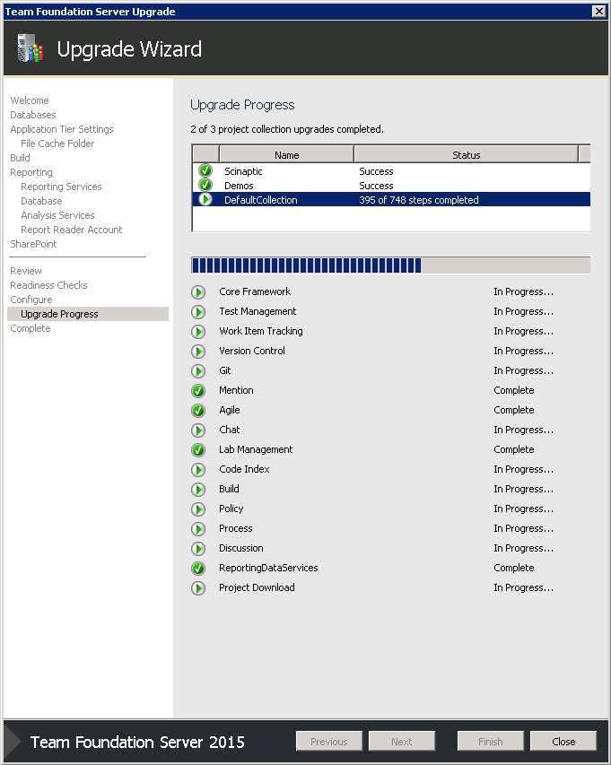
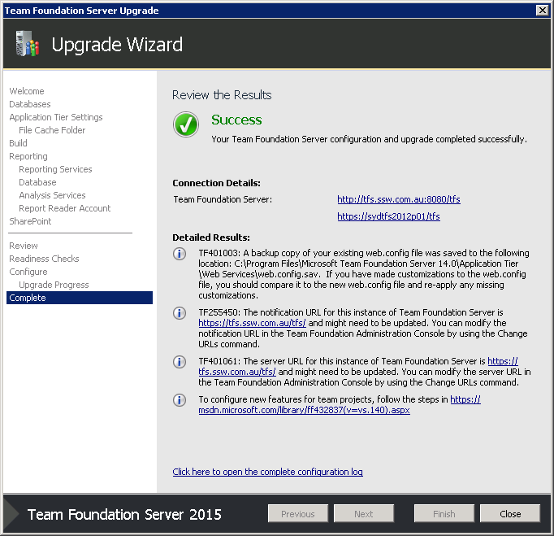

Once you have prepared your environment by creating backups, testing your rollback plan, and set your Project Collections to be offline, you're ready to run the setup process that will perform the upgrade.

 
Here we assume that you are performing an in-place upgrade. Below are the high level steps that you should follow:

a.               [Send an email](http://www.ssw.com.au/SSW/Standards/Rules/RulesToBetterNetworks.aspx#rebootrestart) to let everyone know the TFS server will be offline.

b.              Ensure that your Project Collections are offline.

c.               Run the setup tool from the TFS 2015 media (or ISO).

.                Run through the wizard. It should remember most of your existing settings, so not much configuration is required.

d.              Make sure you have access to coffee while it's upgrading your Project Collections- it could take a while!

** **

**
**

**Figure: TFS Upgrade wizard success!**

** **

Now you're almost done! That covers the core upgrade of your TFS server, your TFS configuration database, and Project Collections.

Next, you'll need to make sure that additional services like XAML Build Configuration and SharePoint integration are configured before testing.
