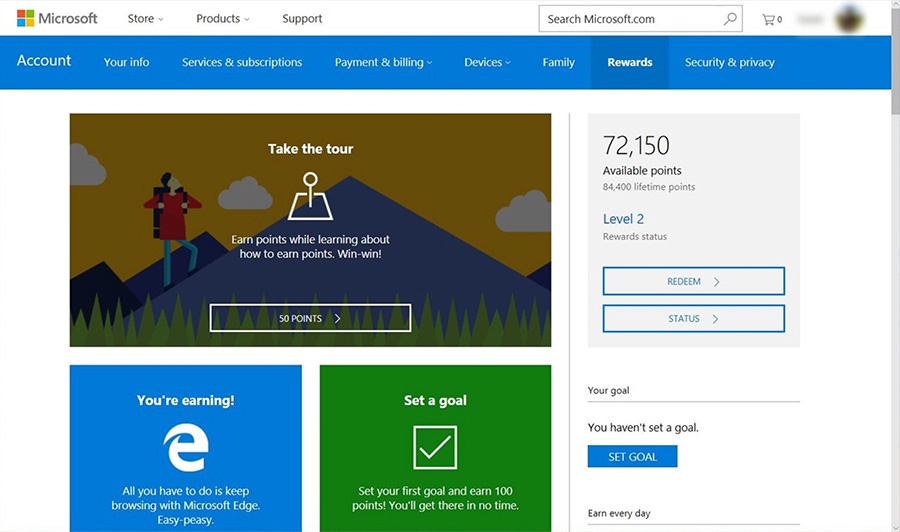
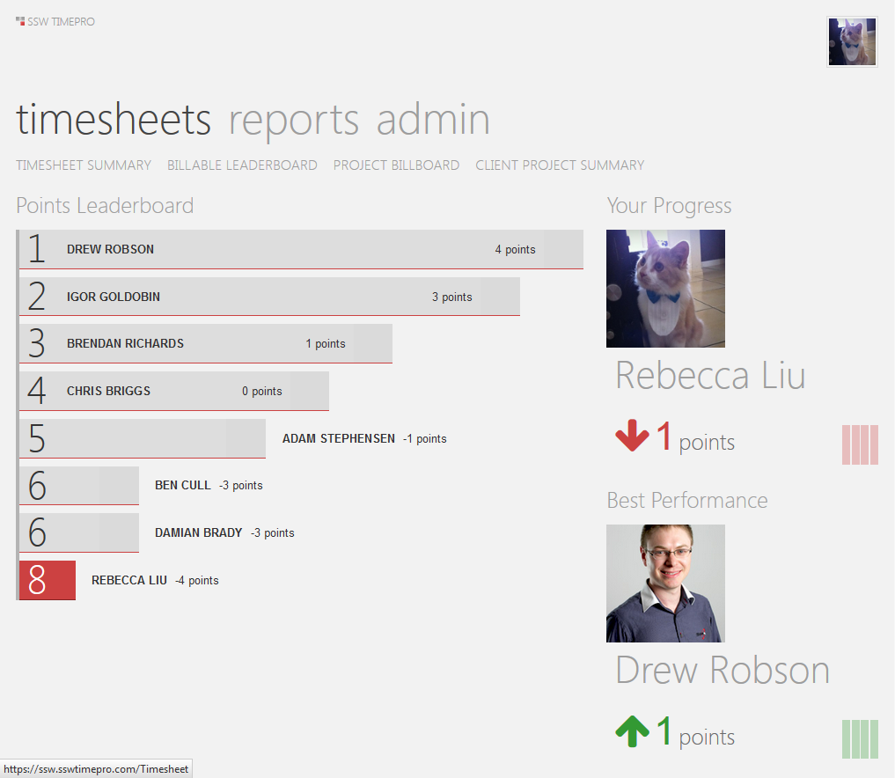
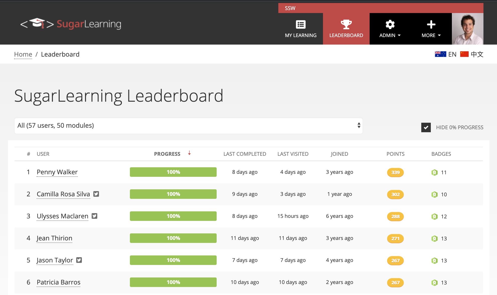
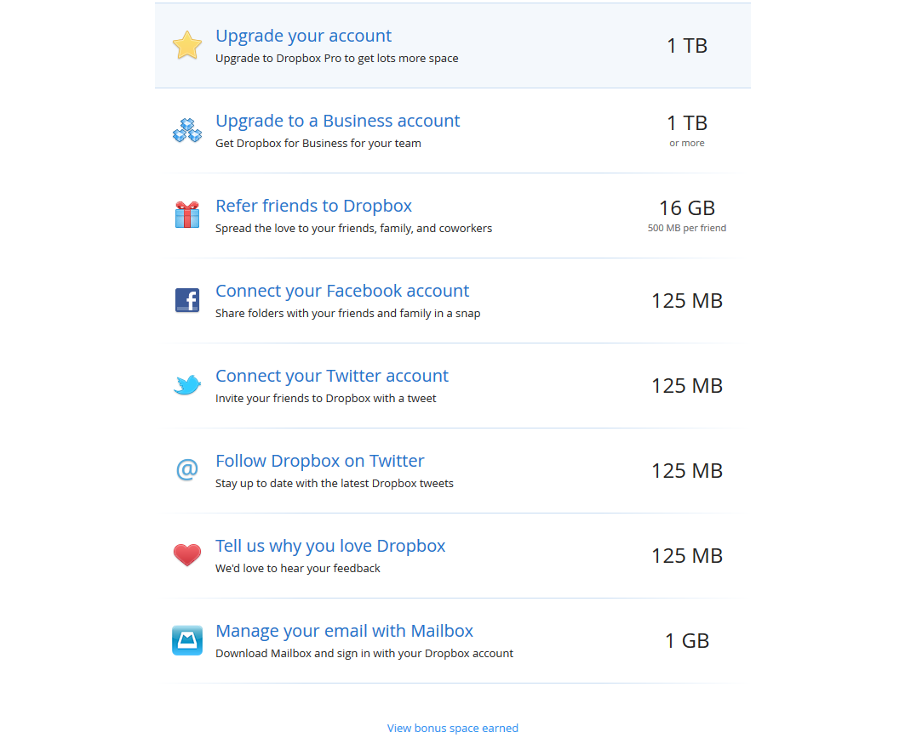

 
​"Gamification" is a method of encouraging user participation. Usually, these are a set of incentives such as points or achievement badges which are linked to some other form of redeemable value.​​
 
​​It originated with Frequent Flyer programs and has crossed over into the software world with the success of Foursquare​.

This concept is being utilized even in     [Visual Studio](https://channel9.msdn.com/achievements/visualstudio). 
Figure: Good Example – Microsoft Rewards gives points when you search on Bing.com and buy things from the Microsoft Store online and in Windows 10
​Figure: Good Example – Stack Overflow uses reputation points, awarded by how useful your answer to other user submitted questions wereFigure: Good Example – TimePro uses gamification to encourage users to do their timesheets on time 
Figure: Good Example – SugarLearning Leaderboard is another good example
Figure: Good Example – Dropbox rewards its users with extra storage space instead of imaginary points. This is more interesting

