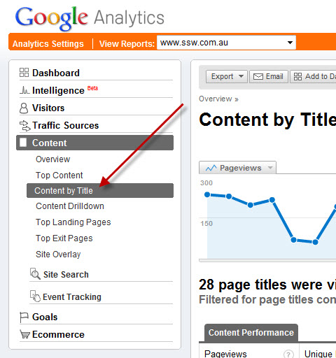
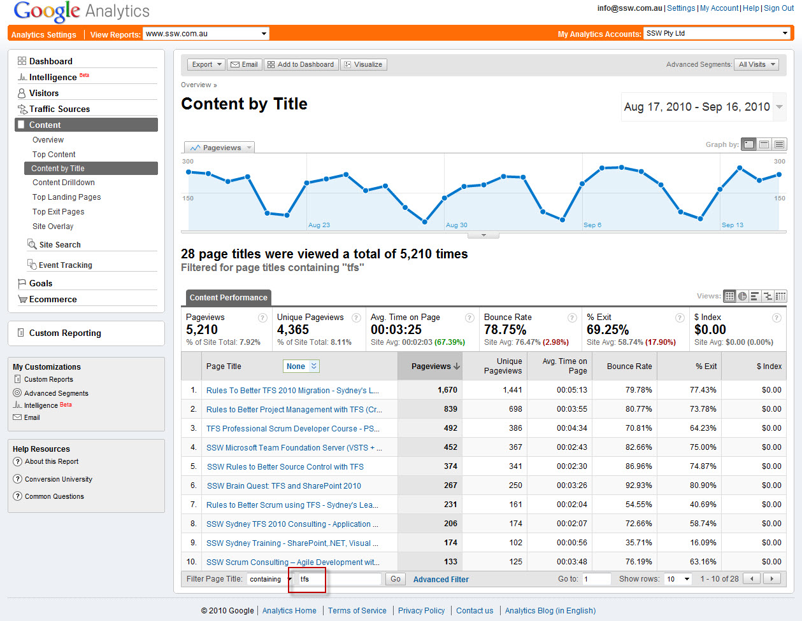
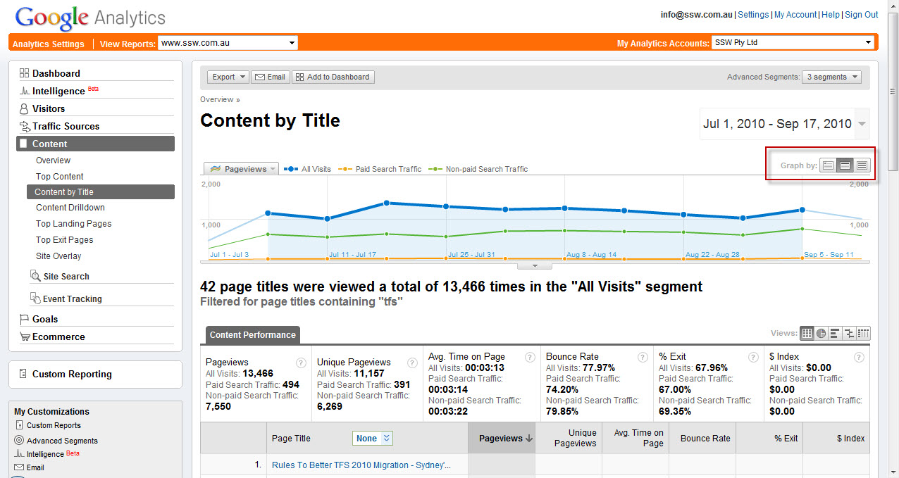
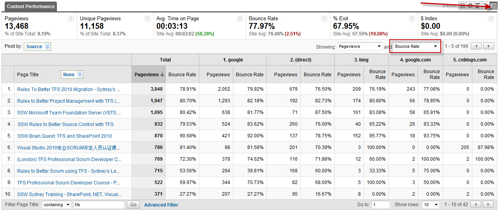
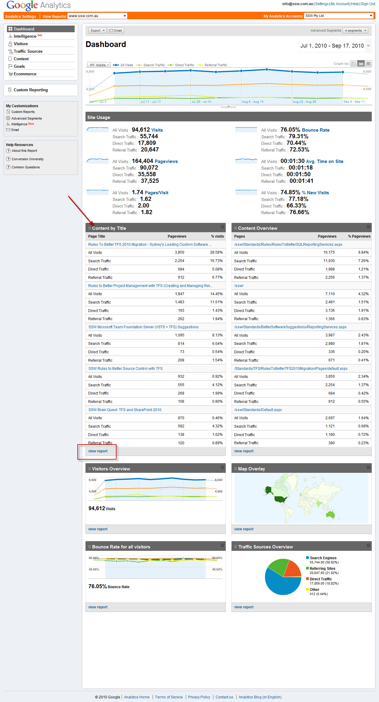

Keeping on top of your web site analytics can be daunting given the vast number of reports that are available in Google Analytics.  
1. ## Content by Title
    Using the Content by Title report is an excellent way to view the improvement in pages that have been created for specific keyword terms.
 
2. ## Setting Date Ranges
    Choose the date range you want to view (eg 12 months)
3. ## Filter By Key Term
    Filter the report by the keyword term you are interested in viewing (eg TFS or SQL Server or SharePoint, etc). This assumes that you have used these keyword terms in the titles of the pages (see [Rules To Better Google Rankings](http://www.ssw.com.au/ssw/Standards/Rules/RulestoBetterGoogleRankings.aspx) for more details on best practices for increasing your Google presence).
 
4. ## View by Day, Week and Month Trends
 
5. ## View Segments
 ](analytics-segments.jpg) 
 ](analytics-content-sources.jpg) 
6. ## Add To Dashboard
 ](analytics-add-dashboard.jpg)
