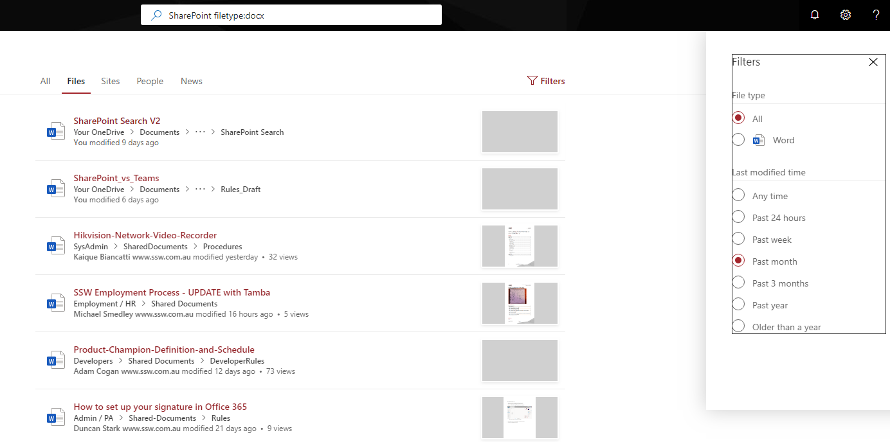

SharePoint search is a powerful tool for discovering information. Here are some tips to make sure you are getting the most from it. There are two things to consider regarding SharePoint search; firstly, how you save information to SharePoint to be more easily discoverable; secondly, how to perform searches within SharePoint.

Here are some tips for performing searches:

### 1. Know how to navigate SharePoint search – watch this video

`youtube: https://www.youtube.com/embed/Vh64ZEC0wcw`
 

 
- Use the categories (top)
- Use the filters (right navigation / faceted search)
- Use the scope to go wider
- Use the specific properties (see below)
- People - Use Delve indexed properties (i.e. Skills)

### 2. Search a specific property 

if you are familiar with the structure of the metadata in the content you're searching, you can restrict your searches to a property with the syntax :. E.g. to search the filename field for the term "report", you would use "filename:report".

Example of properties you can use (common ones);

- Filetype:
- CreatedBy:
- ModifiedBy:
- Title:

More: https://docs.microsoft.com/en-us/office365/securitycompliance/keyword-queries-and-search-conditions

Similar to Google and Bing, you can use OR and AND Boolean operators. E.g. "sharepoint AND search".

[greyBox]
 Note: OR and AND must be capitalized, however case is irrelevant for actual search terms.
 
[/greyBox]

### 4. Use an     [asterisk (\*)](http://en.wikipedia.org/wiki/Asterisk) wildcard for partial matches

This can be useful if you know that certain words are used together, e.g. Fire\* will return results for FireBootCamp.

[greyBox]
 Note: Because of word stemming which is enabled by default in SharePoint 2019, 2016 and 2013, you do not need to use wildcards to find variations on words. For example, searching for "computer" will return results that contain "computers", so you do not need to search for "computer\*". 
 
[/greyBox]

### 5. Use double quotes to find specific phrases

E.g. search for "social media" to make sure you get results for social media, as opposed to results that simply contain the words "social" and "media" in the same document.

### Related Rule

- [Do you know how to use Teams Search?](/_layouts/15/FIXUPREDIRECT.ASPX?WebId=3dfc0e07-e23a-4cbb-aac2-e778b71166a2&TermSetId=07da3ddf-0924-4cd2-a6d4-a4809ae20160&TermId=1f58c5ab-10d5-40f7-8a24-7f88570ad5ef)
- [Do you know how to name SharePoint documents?](/_layouts/15/FIXUPREDIRECT.ASPX?WebId=3dfc0e07-e23a-4cbb-aac2-e778b71166a2&TermSetId=07da3ddf-0924-4cd2-a6d4-a4809ae20160&TermId=281372de-6277-4797-8454-e285cfe02bdf)
