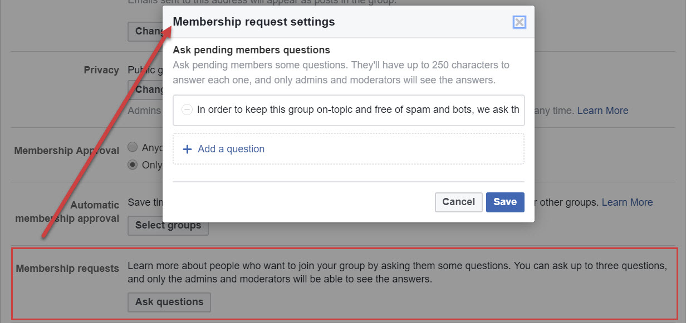

Maintaining a public profile on sites such as Facebook and LinkedIn is a free and easy way to connect with users and keep them updated your products, services or events. The downside to this is that not all who want to connect with you and your groups are real people – some are spammers or bots who will clog up your group, forum or event listing with unwanted advertisements or even links to sites that contain malicious code.

Before approving a membership request, consider:
 

- How old is the account?
- Is the account profile properly filled out?
- Do the name and picture match the listed gender?
- Does the profile picture look “real” (as opposed to a picture of a model that the spammer has stolen from elsewhere)?
- Does the account show real status updates or are they gibberish?
- Are they a member of many incongruous groups that don’t fit with their location?

**Note:** These are only guidelines, not a hard and fast rule. Use your initiative when approving membership requests. 

For groups on Facebook, there is now a tool that allows admin to ask up to 3 preset questions of all users wishing to join. This can be helpful in establishing in separating spammers from legitimate users.

Some sites will allow you moderate comments so that only approved posts are displayed. If you're experiencing ongoing problems with spammers, this might be a good option to use as it keeps your site friendly and professional and gives you the final word on what content is shared with your members or followers.
