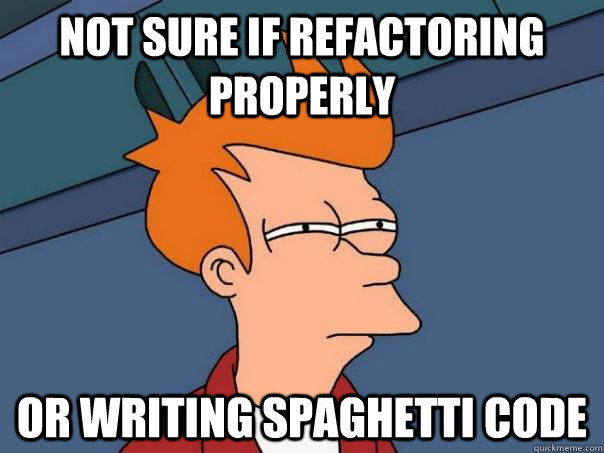

If you get a tradesman in to fix your tap, and on the way to the kitchen he sees your bookcase is messy and re-orders it for you.... you probably wouldn't be very happy.

When you contribute to open source projects it is great to fix bugs and contribute features, but it is essential to be respectful of the people that came before you, and possibly have invested lots of time in putting everything where it currently is.
 ​
[[badExample]]
| 

[[goodExample]]
| 

This issue is described beautifully here http://tirania.org/blog/archive/2010/Dec-31.html​​
