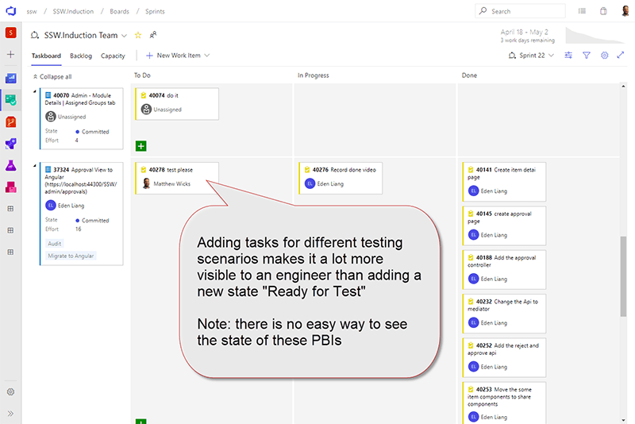
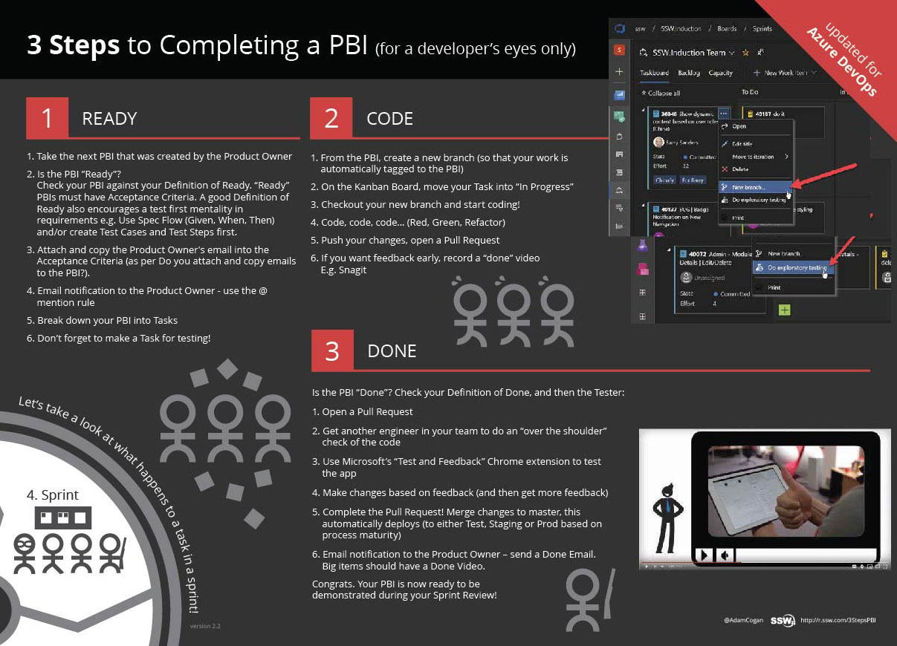

The lifecycle of a PBI can be broken down into 3 steps:
 
### 1. Ready

1. Take the next PBI that was created by the        [Product Owner](/_layouts/15/FIXUPREDIRECT.ASPX?WebId=3dfc0e07-e23a-4cbb-aac2-e778b71166a2&TermSetId=07da3ddf-0924-4cd2-a6d4-a4809ae20160&TermId=d3fc9341-c12c-465c-800b-c8575375d138)
2. Is the PBI ready?
Check your PBI against your        [Definition of Ready](/_layouts/15/FIXUPREDIRECT.ASPX?WebId=3dfc0e07-e23a-4cbb-aac2-e778b71166a2&TermSetId=07da3ddf-0924-4cd2-a6d4-a4809ae20160&TermId=e01abde1-9a3e-4e4c-84a8-50e98e9c44d0). "Ready" PBIs must have Acceptance Criteria. A good Definition of Ready also encourages a test first mentality in requirements e.g. Use Spec Flow (Given, When, Then) and/or create Test Cases and Test Steps first.
3. Attach and copy the Product Owner's email into the Acceptance Criteria (as per [Do you attach and copy emails to the PBI?](/_layouts/15/FIXUPREDIRECT.ASPX?WebId=3dfc0e07-e23a-4cbb-aac2-e778b71166a2&TermSetId=07da3ddf-0924-4cd2-a6d4-a4809ae20160&TermId=bc6e26c0-855a-43d7-a1f4-3d816b7651d3)).
4. Email notification to the Product Owner -        [use the @ mention rule](/_layouts/15/FIXUPREDIRECT.ASPX?WebId=3dfc0e07-e23a-4cbb-aac2-e778b71166a2&TermSetId=07da3ddf-0924-4cd2-a6d4-a4809ae20160&TermId=efd6c91e-7cc5-4473-a299-9104c8fd6e0d)
5. Break down your PBI into tasks.
6. Don't forget to make a task for testing! (So that it is visible in the task board). Note: You can also        [customize the kanban board](https://www.visualstudio.com/en-us/get-started/work/work-from-the-kanban-board-vs) by adding a new column for testing, but we recommend adding a testing task to the PBI instead.

### 2. Code

1. From the PBI, create a new branch (so that your work is automatically taggde to the PBI)
2. On the Kanban Board, move your Task into "In Progress"
3. Checkout your new branch and start coding!
4. Code, code, code… (Red, Green, Refactor)
5. Push your changes, open a Pull Request
6. If you want feedback early, record a Done Video. E.g. Snagit

### 3. Done

Is the PBI "Done"? Check your Definition of Done, and then:

1. Open a Pull Request
2. Get another engineer in your team to do an "over the shoulder" check of the code
3. Use [Microsoft's "Test and Feedback" Chrome extension](/_layouts/15/FIXUPREDIRECT.ASPX?WebId=3dfc0e07-e23a-4cbb-aac2-e778b71166a2&TermSetId=07da3ddf-0924-4cd2-a6d4-a4809ae20160&TermId=14be0d02-79ad-4286-8b78-4f28b0ed4eea) to test the app
4. Make changes based on feedback (and then get more feedback)
5. Complete the Pull Request! Merge changes to master, this automatically deploys (to either Test, Staging or Prod based on process maturity)
6. Email notification to the Product Owner – send a        [Done Email (reply to the original)](/_layouts/15/FIXUPREDIRECT.ASPX?WebId=3dfc0e07-e23a-4cbb-aac2-e778b71166a2&TermSetId=07da3ddf-0924-4cd2-a6d4-a4809ae20160&TermId=29d5ca5d-c191-475f-8db2-0086c44ca46c). Big items should have a        [Done Video](/_layouts/15/FIXUPREDIRECT.ASPX?WebId=3dfc0e07-e23a-4cbb-aac2-e778b71166a2&TermSetId=07da3ddf-0924-4cd2-a6d4-a4809ae20160&TermId=f5fc27ce-af9d-4b57-ad64-3893dacc09e3)
7. Check the Acceptance Criteria for notes about email attachments (as per        [Do you attach emails to the PBI?](/_layouts/15/FIXUPREDIRECT.ASPX?WebId=3dfc0e07-e23a-4cbb-aac2-e778b71166a2&TermSetId=07da3ddf-0924-4cd2-a6d4-a4809ae20160&TermId=5baf5235-c66a-4e3d-9b27-55a4859ae8a2)).

Congrats. Your PBI is now ready to be demonstrated during your Sprint Review! (Note: This is also the same process you follow for a Bug work item)
 Good Figure: This image includes all the important steps in a PBI lifecycle. Print this "[SSW 3 Steps to a PBI pdf](/Documents/3StepsToAPBI.pdf)" and put it on your 'War Room' wall
