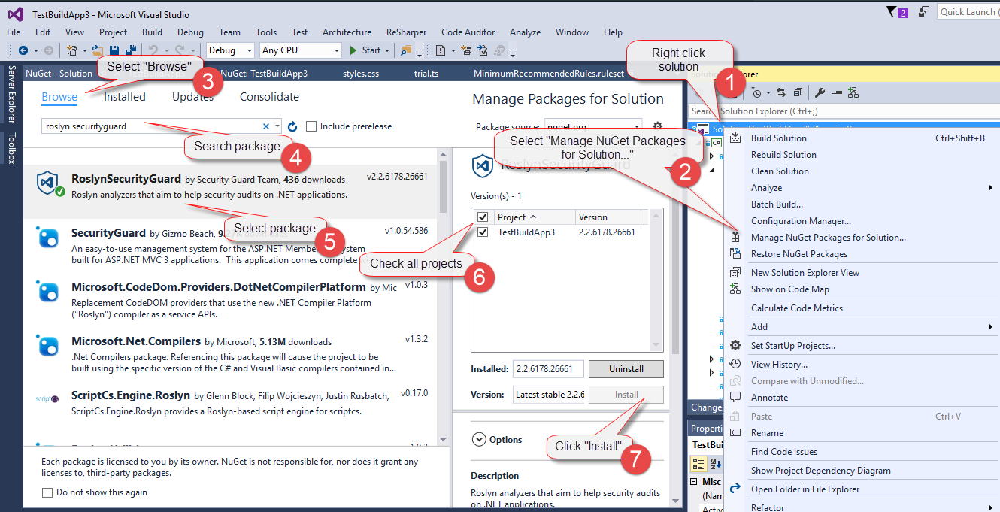
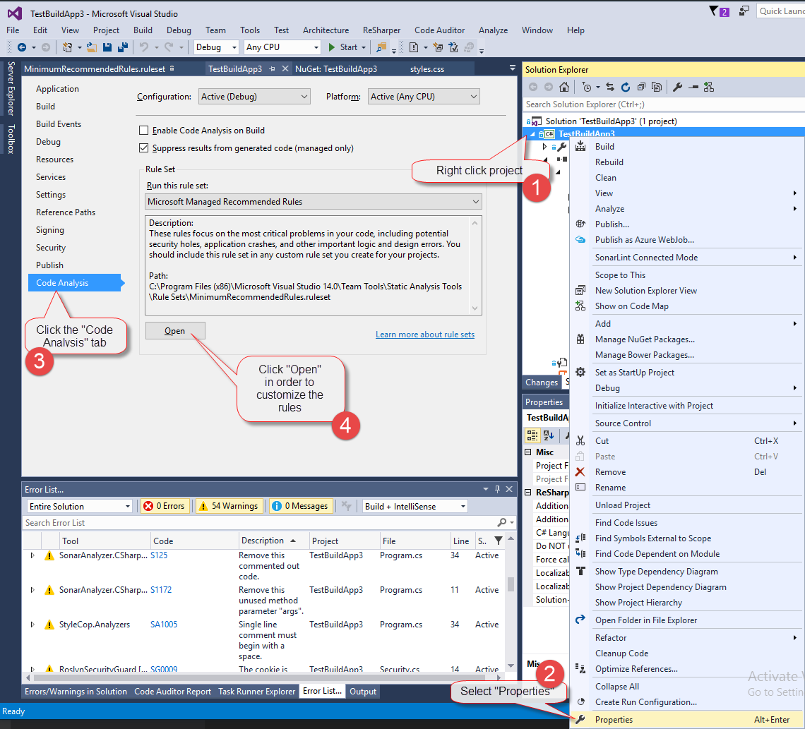
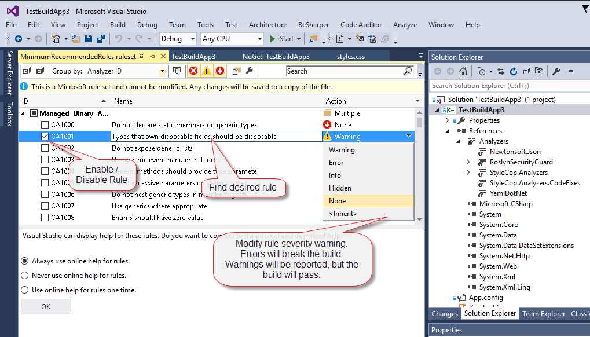
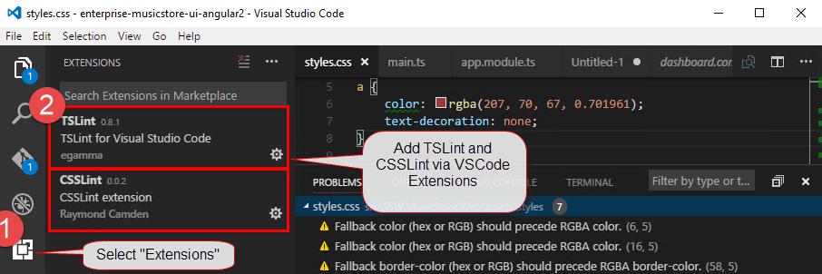
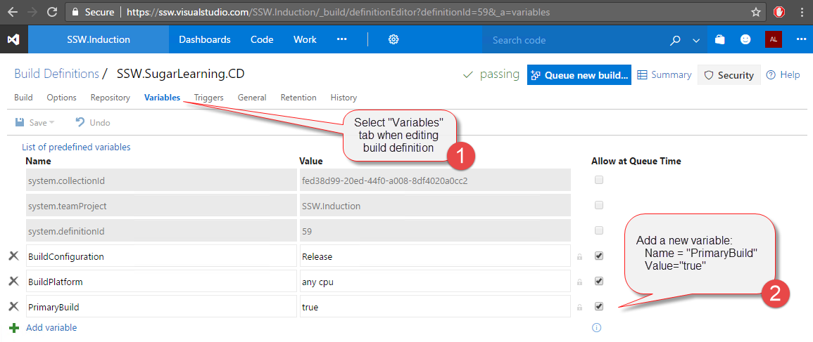

Code health is all about quality and consistency. Here is how to use various auditors and linters not just in your development environment, but also on your VisualStudio.com build.
 
Depending on your development environment and the type of project, you should utilise different auditing tools.
 1) Visual Studio - How to install and modify Visual Studio Analysers
 2) Visual Studio Code - How to include TSLint and CSSLint extensions
 3) VisualStudio.com - How to produce a build script which analyses code as part of the build process

Following the steps should take about 15 minutes to do, but longer to implement depending on the size of your solution. (Requires solution analysis in VS and at least one build on VisualStudio.com)

Version 1.2
- Added step to include "PrimaryBuild" variable as a pseudo id for the API
Version 1.1
- Removed CssLint from VisualStudio.com build definition
- Added Web Essentials to Visual Studio environment

### Visual Studio

Search & Install the NuGet packages:
"Roslyn Security Guard " https://www.nuget.org/packages/RoslynSecurityGuard/
"StyleCop.Analysers" https://www.nuget.org/packages/StyleCop.Analyzers/1.0.0
"tslint" https://www.nuget.org/packages/tslint/

For Visual Studio development on web applications, download Web Essentials, it will provide intellisense for JS, CSS, HTML, Less, Scss, and CoffeeScript. (https://marketplace.visualstudio.com/items?itemName=MadsKristensen.WebEssentials20153 )

Here is a quick guide to the steps to install NuGet Packages to the entire solution:
 1) Right click solution
 2) Select "Manage NuGet packages for solution"
 3) Select "Browse"
 4) Search 
 5) Select 
 6) Check all projects
 7) Click "Install"

Issues from these will now be returned in the Visual Studio analyser error list.

Run Code Analysis on the project. Check over all of the warnings, if they are unnecessary or inappropriate, disable them, otherwise modify their severity level to "Error". 
When the build is run, "Errors" will break the build, while "Warnings" will be reported, but not break the build.
Rules which have been flagged should also be checked once the build is completed

### Modify Visual Studio Analysis

The goal is to develop a shared ruleset across projects. (Currently this is just the default settings)
Any project specific rules should be documented in "\_Instructions-CodeHealth.docx" kept in the solution.
Please also copy the current version number of this rule into the "\_Instructions-CodeHealth.docx" in order to track what version your existing solution adheres to.

The current standard for rules is just the default ones. Frequently check back here for updates to the ruleset definition.

Right Click project | Properties | Code Analysis | Open

### Visual Studio Code

For web projects, we advocate the use of CSSLint for css files and TSLint for typescript files. ([Why you should be using TypeScript instead of JavaScript](/_layouts/15/FIXUPREDIRECT.ASPX?WebId=3dfc0e07-e23a-4cbb-aac2-e778b71166a2&TermSetId=07da3ddf-0924-4cd2-a6d4-a4809ae20160&TermId=d82703e0-6244-4fb6-9017-bac4e4b2361d))

Linters for these can be easily added to VS Code via extensions.
Simply select the "Extensions" tab, search for "CSSLint" and "TSLint" and click "Install" on each respectively.

If you prefer not to use the Extensions (which are currently a bit out of date). You can install them using npm as normal.

CssLint https://www.npmjs.com/package/csslint
TSLint https://www.npmjs.com/package/tslint

### Automatically Check your Build in VisualStudio.com

Ensure utilisation of TeamBuild2015 or higher. (No support for XAML builds)
Edit the build definition

Select "Build & Release" > Select "Builds" > Click on your existing build > Click "Edit"

Under advanced for the Command Line tasks, the Working Directory can be specified if necessary.

TsLint

**Npm **- Install tslint and typescript
**Name: **npm install tslint
**Working Folder:** 
**Npm Command:** install
**Arguments:** -g tslint typescript

**Command Line** - Check the version (Useful to determine rule discrepancies across builds)
**Name**: Check tslint version
**Tool: **tslint
**Arguments:** -v

**Command Line** - Builds a default configuration file for the build (Without it issues can differ between build and development environment
**Name: **Create tslint config file
**Tool: **tslint
**Arguments: **--init

**Command Line** - Run tslint, force is required to stop the build from crashing (TSLint will return and exit code of 1 regardless of if issues exist)
**Name: **Run tslint
**Tool: **TSLint
**Arguments: **--force /\*\*/\*.ts{,x}

If your build is being hosted, then the config file must be reloaded every time. If your build is running on premises, the config file will attempt to load over the existing one and break the build.
If this is the case, just add a step to delete your config file after the scan is complete.

(tslint.json) after the linter has run

**Command Line** - Remove the tslint config file, as it will break future scan if the build is on premises if a config file already exists and an attempt to add another one is made.
**Name: **Remove tslint config
**Tool: **del
**Arguments:** tslint.json

Once complete, save the build definition and run the build.
Then check the build is successful.
If the build fails (due to errors), these should be corrected in the development environment. 
If warnings exist, the rule should be disabled or set as an error. (If it is worth fixing, then it should be required for everyone)

At the moment, it is fine to leave the warnings in the build, since the defined standard of rules is not set

If your project does not contain TypeScript files, then you do not need to include the TSLint build tasks.

(if the project includes TSLint files) otherwise it will pass without you noticing

For the purposes of reporting, a unique tag must be added to the build definition which the Code Health steps have been applied to. 
This is done with the addition of a variable (Name = PrimaryBuild, Value = true)

[[badExample]]
| 

[[badExample]]
| 

[[goodExample]]
| 
