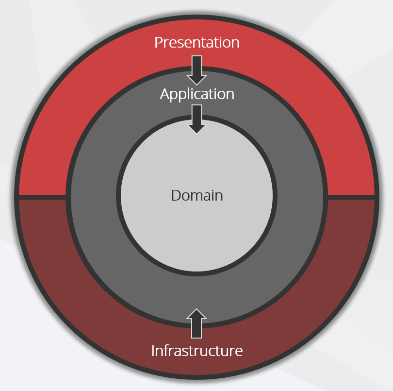

With Clean Architecture the Domain and the Application layers are at the centre of the design. This is known as the Core of the application. The Domain layer contains the enterprise logic and types and the Application layer contains the business logic and types. The difference being that enterprise logic could be shared with other systems whereas business logic would typically be specific to this system.

 
Instead of having Core depend on data access and other infrastructure concerns, we invert these dependencies, therefore Infrastructure and Presentation depend on Core. This is achieved by adding abstractions, such as interfaces or abstract base classes, to the Application layer. Layers outside of Core, such as Infrastructure and Persistence, then implement these abstractions.

A good example is the implementation of the Repository pattern. Within this design, we would first add an IRepository interface to the Application layer. Next, we would implement this interface within Persistence by creating a Repository class using our preferred data access technology. Finally, within Core the logic we write will only use the IRepository interface, so Core will remain independent of data access concerns.

With this design, all dependencies must flow inwards. Core has no dependencies on any outside layers. Infrastructure, Persistence, and Presentation depend on Core, but not on one another.

This results in an architecture and design that is:

- **Independent of Frameworks** - *Core should not be dependent on external frameworks such as Entity Framework*
- **Testable** -  *The logic within Core can be tested independently of anything external, such as UI, databases, servers. Without external dependencies, the tests are very simple to write.*
- **Independent of UI** - *It is easy to swap out the Web UI for a Console UI, or Angular for Vue. Logic is contained within Core, so changing the UI will not impact logic.*
- **Independent of Database** -  *Initially you might choose SQL Server or Oracle, but soon we will all be switching to Cosmos DB*
- **Independent of anything agency** -  *Core simply doesn't know anything about the outside world*

While the design in the above figure only includes three circles, you may need more - just think of this as a starting point.

### References

- [The Clean Architecture](http://blog.cleancoder.com/uncle-bob/2012/08/13/the-clean-architecture.html)
- [Clean architecture](https://docs.microsoft.com/en-us/dotnet/standard/modern-web-apps-azure-architecture/common-web-application-architectures#clean-architecture)
