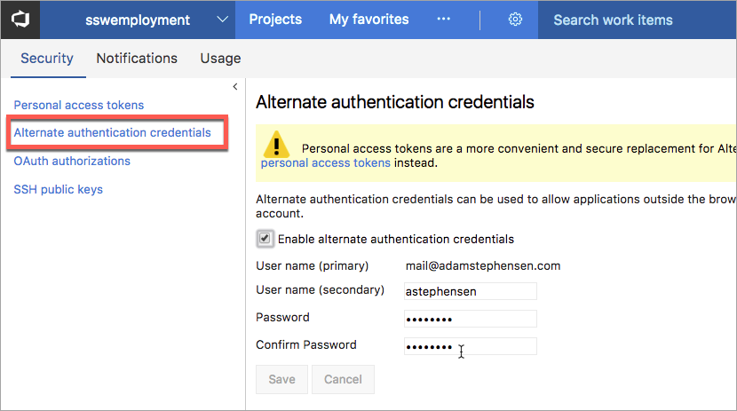
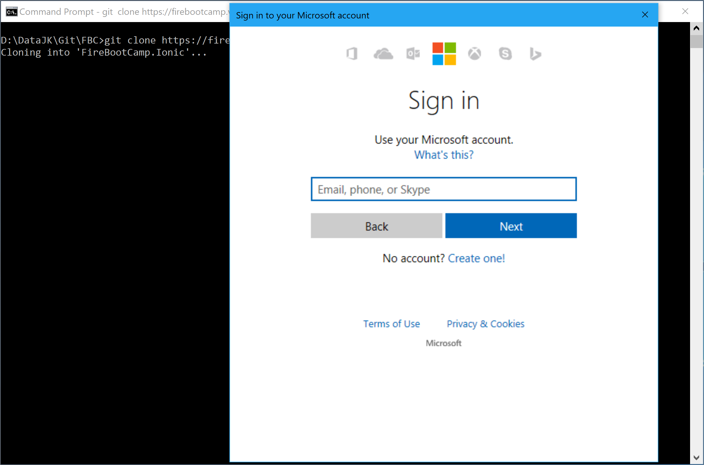

When you create a new git repository and need to push it to VSTS you need to provide login credentials.

It isn't always clear how to do this.
 
[[badExample]]
| 

Instead, you should use Personal Access Token. You can do this in two ways.

The first option is to make sure your Git for Windows is up-to-date and when cloning the repository, you use Microsoft Account to log in. Personal Access Token for Git will be created for you.

[[goodExample]]
| 

Option 2 is to manually create Personal Access Token and use it as a password for Git login.

You can follow this blog post for full instructions: [Using Personal Access Tokens to access Visual Studio Online](https://roadtoalm.com/2015/07/22/using-personal-access-tokens-to-access-visual-studio-online/).

[[goodExample]]
| 
