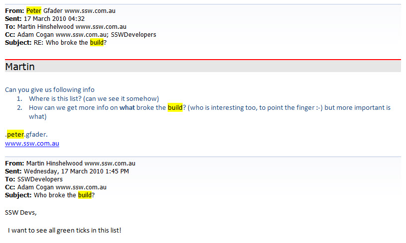
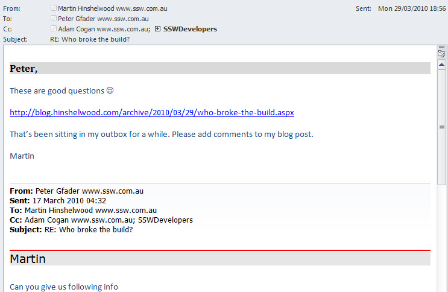

​​As long as there is nothing confidential or NDA in the content, any discussion point should be made public. Transparency is the name of the game. The more transparency you have between customers, management, and your technical employees the better. This fosters trust and a closer working relationship.​​
  
[[badExample]]
|  

[[goodExample]]
| 

So keep jewels from being left in your inbox. Remember that you are inviting replies​, and that the gold in this process.

**Note:** If the discussion is not worth a blog post, then tweet it and link to the rule.
