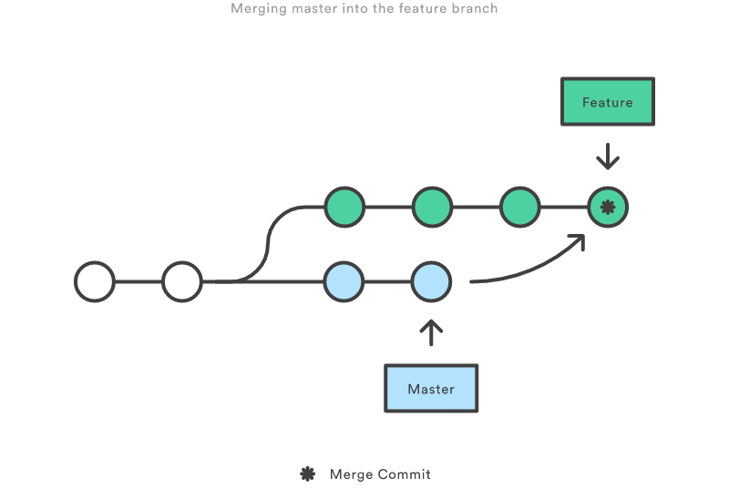
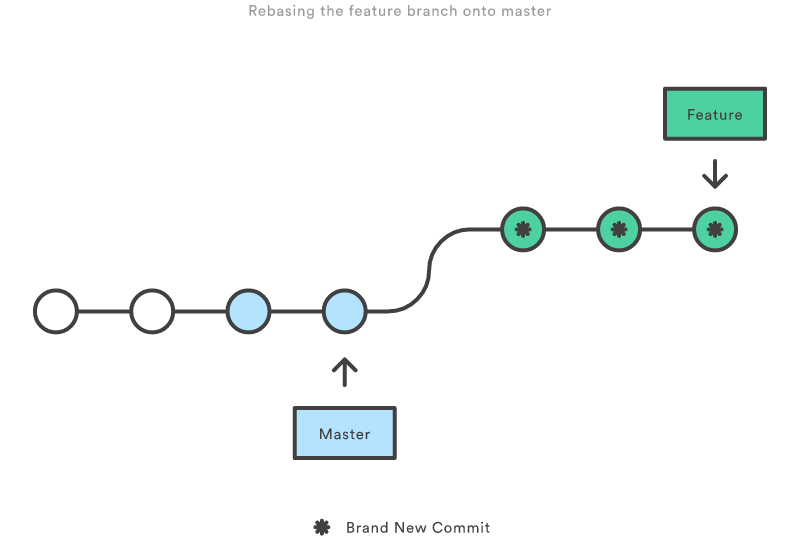

 
When you merge a branch you end up with messy merge commits.

Rebasing might take a bit to get your head around, but you get a much cleaner project history.​
 
- it eliminates the unnecessary merge commits required by git merge
- rebasing also results in a perfectly linear project history - you can follow the tip of feature all the way to the beginning of the project without any forks.

This makes it easier to navigate your project with commands like git log, git bisect, and gitk.
Figure: When merging: a messy merge commit is created any time you need to incorporate upstream changes from the master branch Figure: Git Rebase moves your new commits to the end of the master branch. This ensure that you don't end up with messy merge commits and you have a clean linear project history
**Warning:** If you don’t follow [the Golden Rule of Rebasing](/_layouts/15/FIXUPREDIRECT.ASPX?WebId=3dfc0e07-e23a-4cbb-aac2-e778b71166a2&TermSetId=07da3ddf-0924-4cd2-a6d4-a4809ae20160&TermId=cb4fd562-6c0a-418c-88c5-9af1b9451469), you could end up in a ​world of pain.
​  
