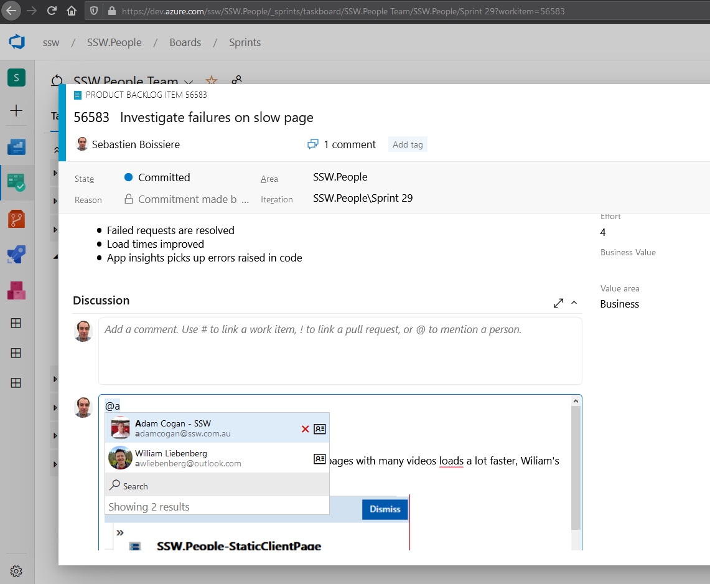
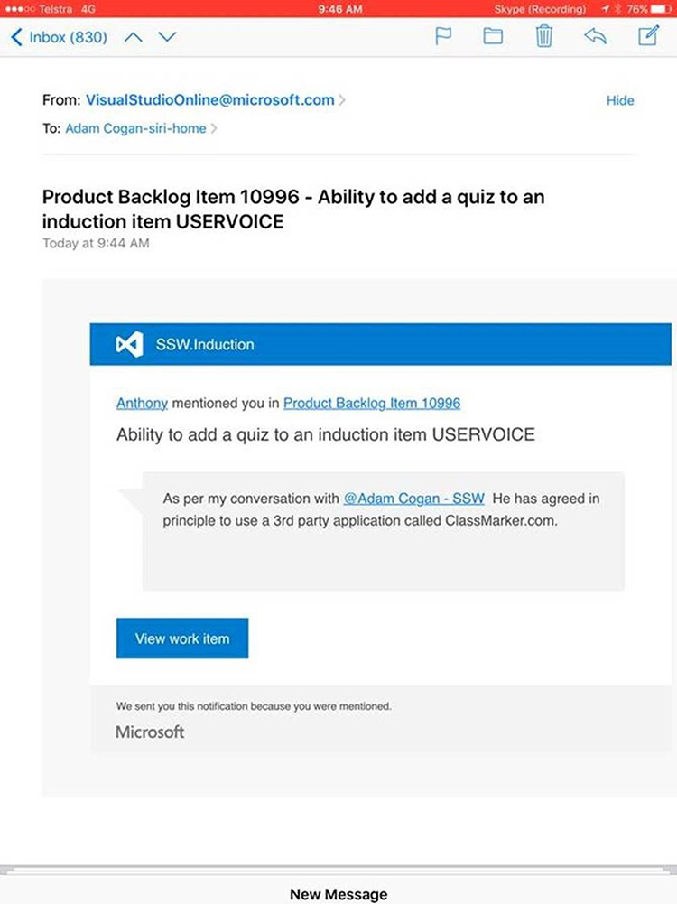

​​​So when the Product Owner verbally requests a change to a PBI how do you update the PBI to reflect the change and also keep track of the conversation?
 
You could send yourself a "​[To Myself](/_layouts/15/FIXUPREDIRECT.ASPX?WebId=3dfc0e07-e23a-4cbb-aac2-e778b71166a2&TermSetId=07da3ddf-0924-4cd2-a6d4-a4809ae20160&TermId=5c16d531-007d-49ef-8acc-b26596e13e84)" email and update the PBI description accordingly, but only those people included in the email chain are aware of the conversation.

[[badExample]]
| 

Instead, what you should do is use the discussions feature in the PBI and mention the user using "@". 
The benefits of using comments are:

- Quick and easy, no need to compose email
- History is visible to anyone looking at the PBI (with email, if you don’t cc them, they wouldn’t have a clue)
- Easy to see all important notes/comments in one place instead of digging through email

[[goodExample]]
| 

[[goodExample]]
| 

### Related ​Links

- [Interruptions - Do you know that IM interrupts?](/_layouts/15/FIXUPREDIRECT.ASPX?WebId=3dfc0e07-e23a-4cbb-aac2-e778b71166a2&TermSetId=07da3ddf-0924-4cd2-a6d4-a4809ae20160&TermId=d68a015b-fa82-419d-97f0-266ba8fb4e5d)
- ​[Suggestion to Microsoft Azure DevOps ​- Help me know there is an image in the Work Item](https://bettersoftwaresuggestions.com/microsoft/azure-devops/help-me-know-there-is-an-image-in-the-work-item/)​
- [Zendesk - Do you reply to the correct Zendesk email?​​](/_layouts/15/FIXUPREDIRECT.ASPX?WebId=3dfc0e07-e23a-4cbb-aac2-e778b71166a2&TermSetId=07da3ddf-0924-4cd2-a6d4-a4809ae20160&TermId=1da8f964-7564-4ed3-b847-749becaa42c1)
