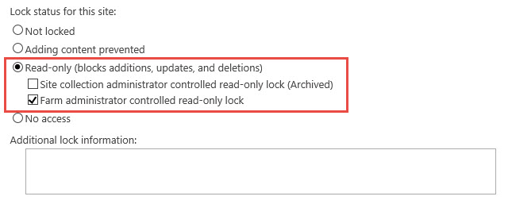
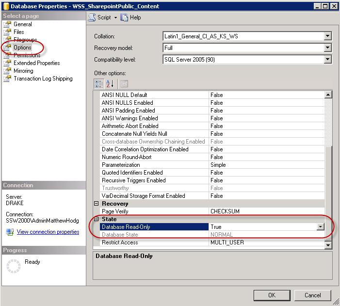

Even though you have advised staff members a migration is taking place – you can guarantee someone will try to check-in or edit documents. The best way to prevent this is to put your content database into read-only mode, locking the content database. 
There are two options to lock the content database.

Option 1 (**Recommended**):

1.  Open **SharePoint Central Administration** site, navigate to "**Application Management**" | "**Site Collections**" | "**Configure quotas and locks**".

2. Select the "site collection" which you would like to lock.

3. Choose "Read-only (blocks additions, updates, and deletions)", then click "OK".

Note: Read more at [Manage the lock status for site collections in SharePoint 2013](https://technet.microsoft.com/en-us/library/cc263238%28v=office.15%29.aspx?f=255&MSPPError=-2147217396)
Option 2 (**not recommended**):

1.    On your database server open     **SQL Server Management Studio**

2.    Right click on the content database associated with the site collection you're migrating | **Properties**

3.    Choose     **Options** | Scroll to the bottom of the options list

4.    For the     **Database Read-Only** choose True

Figure - Database Properties | Options | Database-Read Only
5.    Now it’s safe to take a backup of your content database

**NOTE:**  When some SharePoint timer services are run it may cause the site to display errors when the database is in read-only mode
