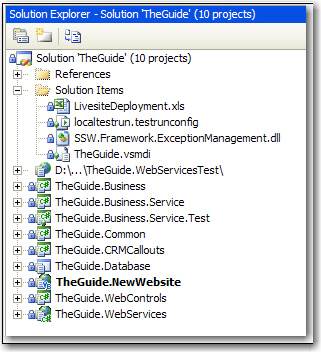

Developers are better at coding then creating documentation. However project instructions are very important to enable developers to get up and running quickly.
 
In the prior rule:      [Do you review the documentation? we learnt of the 6 documents](/_layouts/15/FIXUPREDIRECT.ASPX?WebId=3dfc0e07-e23a-4cbb-aac2-e778b71166a2&TermSetId=07da3ddf-0924-4cd2-a6d4-a4809ae20160&TermId=951ffbf9-4066-42f3-a9b7-e0d8603e728b)

There are 4 levels of project documentation. Documentation can start simple but ends up having a lot of manual steps. The best projects have simple documentation but more done automatically (level 4).

### Level 1 - Lots of documentation step by step

Add a document as a solution item and name it '\_Instructions.docx'

Tip: Microsoft Word documents are preferred over .txt files because images and formatting are important

You can also break up this document into 4 smaller documents

- \_Business.docx - Explaining the business purpose of the app
- \_Instructions\_Compile.docx - Contains instructions on how to get the project to compile
- \_Instructions\_Deployment.docx - Describes the deployment process
- \_Technologies.docx - Explaining the technical overview e.g. Broad architecture decisions, 3rd party utilities, patterns followed etc

Here's a suggestion of what these documents could contain.

1. Project structure            All parts that composes the project and how they work with each other.
2. Third party components            Any software, tools and DLL files that this project uses. (e.g., NHibernate, ComponentArt, KendoUI)
3. Database configuration
4. Other configuration information
5. Deployment information and procedures  
6. Other things to take care of

Bad
Good

Add a readme.md to your solution (Use [this](https://docs.microsoft.com/en-us/azure/devops/project/wiki/markdown-guidance?view=vsts)  as a guidance for markdown)

### Level #2: Lots of documentation (and the \*exact\* steps to Get Latest and compile)

When a new developer starts on a project you want them to get up and running as soon as possible.

[[greyBox]]
|  If you were at Level 2 you might have a document that says:
| Dear Northwind Developer
|      This documentation describes what is required to configure a developer PC.
| 
| Problems to check for:
| Windows 8 not supported
| Many things to build
| Lots of dependencies
|  

You are at Level 2 when you have some static Word documents with the steps to compile. The \_instructions\_compile.docx contains the steps required to be able to get latest and compile.

### Level #3: Lots of documentation (and the exact steps to Get Latest and compile with the \*database\*)

[SSW SQL Deploy](http://sqldeploy.com/) to make keeping all databases on the same version simple. Check out        [how to use SQL Deploy here](http://tv.ssw.com/969/adam-stephensen-sql-deploy-demo)
### Level #4: Less documentation (and Get Latest and compile with a PowerShell script)

A perfect solution would need no static documentation. Perfect code would be so self-explanatory that it did not need comments. The same rule applies with instructions on how to get the solution compiling: the best answer would be for the solution to contain scripts that automate the setup.

Example of Level 6: PowerShell Documentation

**Recommendation:** All manual workstation setup steps should be scripted with powerShell (as per the below example)

**Recommendation:** You should be able to get latest and compile within 1 minute. Also, a developer machine should not HAVE to be on the domain (to support external consultants)

[[goodExample | you see the problems in the devs environment]]
|  PS C:\Code\Northwind> **.\Setup-Environment.ps1** 
| 
| Problem: Azure environment variable run state directory is not configured (\_CSRUN\_STATE\_DIRECTORY).
|  
| Problem: Azure Storage Service is not running. Launch the development fabric by starting the solution.
|  
| WARNING: Abandoning remainder of script due to critical failures.
|  
| To try and automatically resolve the problems found, re-run the script with a -Fix flag.
|

[[goodExample | when running with -fix this script tries to automatically fix the problem  ]]
|         
| PS C:\Code\Northwind> .\Setup-Environment.ps1 -fix
| 
| Problem: Azure environment variable run state directory is not configured (\_CSRUN\_STATE\_DIRECTORY).
| 
| Fixed: \_CSRUN\_STATE\_DIRECTORY user variable set
|  
| Problem: Azure Storage Service is not running. Launch the development fabric by starting the solution.
| 
| WARNING: No automated fix availab le for 'Azure Storage Service is running'
|  
| WARNING: Abandoning remainder of script due to critical failures.
|

[[goodExample | Note that on the 2nd run, issues resolved by the 1st run are not re-reported  ]]
|         
| 
| PS C:\Code\Northwind> .\Setup-Environment.ps1 -fix
| 
| Problem: Azure Storage Service is not running. Launch the development fabric by starting the solution.
| WARNING: No automated fix available for 'Azure Storage Service is running'
| 
| WARNING: Abandoning remainder of script due to critical failures.
| 
| 
|

## Further Reading

To see other documentation Rules, have a look at     [Do you review the documentation?](/_layouts/15/FIXUPREDIRECT.ASPX?WebId=3dfc0e07-e23a-4cbb-aac2-e778b71166a2&TermSetId=07da3ddf-0924-4cd2-a6d4-a4809ae20160&TermId=951ffbf9-4066-42f3-a9b7-e0d8603e728b)
