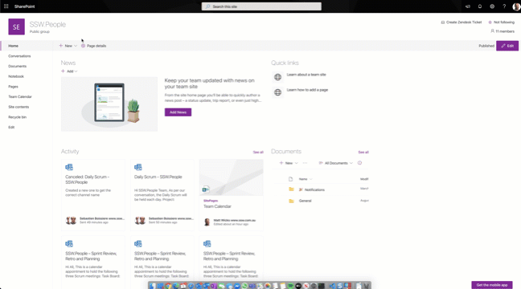
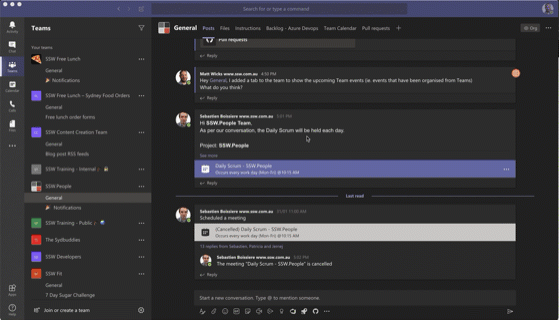
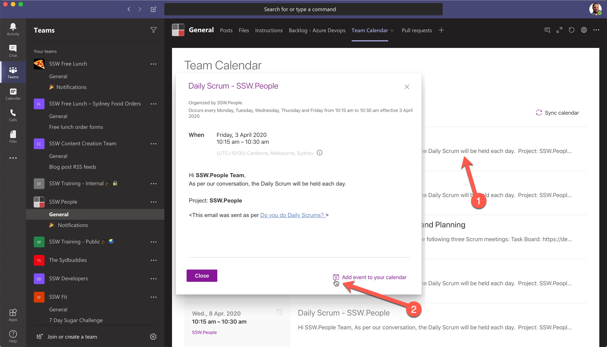

When joining a new team, it's easy to be lost and not know when the important meetings are (like the Daily Scrum, or the next Sprint Review). If you  [run the meetings from Microsoft Teams](/_layouts/15/FIXUPREDIRECT.ASPX?WebId=3dfc0e07-e23a-4cbb-aac2-e778b71166a2&TermSetId=07da3ddf-0924-4cd2-a6d4-a4809ae20160&TermId=91a6a999-29d4-4903-8b7a-16fddd976d65) you can make them easy to find!  ](team meetings - bad example.jpg)
1. Open up the Team's SharePoint site (you can find this easily by going to the        *Files* tab and clicking        *Open in SharePoint*)
2. Go to the SharePoint site's Home page (from the menu on the left)
3. Add a new page
4. Add a Group Calendar web part to the page
5. Publish the page

6. In Teams, click add a new SharePoint tab to the Team
7. Select the newly published SharePoint page
8. Click Save

9. All done 😀
[This is an unnecessary extra hoop to jump through. If you create an appointment from a Team then this tab should be automatically created.](https://microsoftteams.uservoice.com/forums/555103-public/suggestions/36007027-add-a-team-calendar-to-teams-or-allow-a-project-te)

