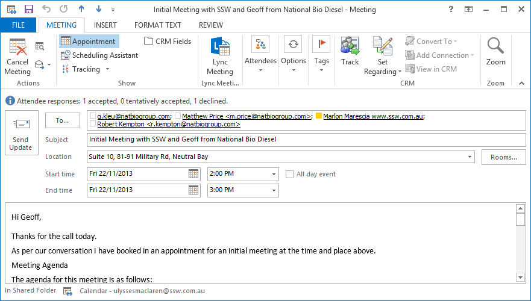

With the amount of money companies spend on marketing these days, it's vital that, when you receive a phone call enquiring about your services, you know how to handle it.
 
Be prepared for [inbound calls](http://www.ssw.com.au/SSW/Standards/Rules/RulesToBetterInboundCalls.aspx#Preparation). You should have a script that your phone operators keep close at hand to make sure you ask the necessary qualifying questions. The aim is to determine if you are a good match with the prospect - that way you don't spend time on dead ends and can give more time to the most likely leads.

Once you have qualified the lead, your aim for the remainder of the call should be to arrange a face-to-face Initial Meeting with the client.

1. Agree on a time for an initial meeting.

2. Send this email [Pre Initial Meeting](/Documents/BriefProposal-PreInitialMeeting.docx).

3. Send an appointment to the client and everyone attending the meeting (copy the email above.).

If the client wants to commence ad-hoc work (e.g. Consulting) without a meeting, you should immediately:

1. [Enter a contract](/Pages/Enter-into-a-binding-written-contract-with-a-client-before-doing-any-billable-work.aspx) with the client.

2. Enter the contact information for the lead into your corporate database.

3. Book it in by sending an appointment (set regarding to the client if you're using CRM)
