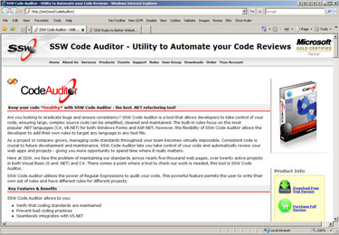

The way you present information to prospective clients determines its effectiveness.        In a cluttered environment we skilfully organize information for the greatest impact.        When advertising software we like to use the following standard.
 
1. **First Sentence (aka Tag Line)**
 This is a one line sentence that explains the benefits of using the software. This description is non-technical, but should give an idea of who the software is for. E.g. "Automate your code reviews with SSW Code Auditor"
2. **First Paragraph**
 A paragraph that describes in greater the detail what the software does, what Microsoft products it works with (e.g. Access, Outlook, SQL Server etc) and any initial technical notes. E.g. "SSW SQL Total Compare resolves data conflicts with SQL Server Replication. This tool reports the differences between the Publisher and Subscribers the data."
3. **Key Features & Benefits**
 It's now time to convince the web surfer that they want the product. This section needs to summarize in bullet points why this product is going to solve their problems. If necessary group the benefits into logical categories.
4. **Screen Shots**
 One screen shot on the first page is important for customers to get the look and feel of the application. Then link to more screenshots.
5. **A Recorded Demonstration**
 Customers love demonstrations especially when they are faced with using a product that they have never used before. An .avi is a great and innovative way to coach people on how to use products, and work with regardless of where they are around the world.
6. **Testimonials**
 Place a testimonial from another user who's already using the software. Customer's tesimonial tends to be informal and the message can be easily understood by your visitors.
7. **User Guide**
 This is help facility is designed to quickly get you up and running. Once again if you can offer it to customers make sure you let them know about it
8. **How it works**
 This is a brief technical description of what goes on behind the scenes
9. **System Requirements**
 The minimum system specifications to run the application.
10. **Support**
 One of the most important attributes that customers of software products look for when they make a purchase is whether or not there will be support if they are stuck and having difficulties with the software. One very cost effective method of support is to provide a        [knowledge base](http://www.ssw.com.au/ssw/KB/KBSearch.aspx) where customers are free to seek the answers to their own problems.

