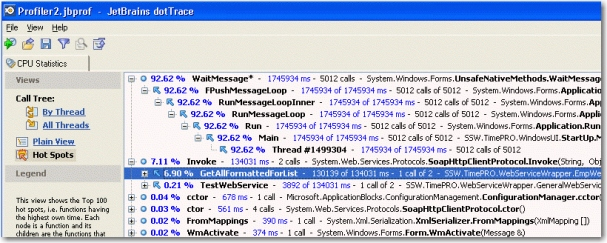

Imagine that you have just had a User Acceptance Test (UAT), and your app has been reported as being "painfully slow" or "so slow as to be unusable". Now, as a coder, where do you start to improve the performance? More importantly, do you know how much your massive changes have improved performance - if at all?   
<!--endintro-->

We recommend that you should always use a code profiling tool to measure performance gains whilst optimising your application. Otherwise, you are just flying blind and making subjective, unmeasured decisions. Instead, use a tool such as [JetBrains dotTrace profiler](http://www.ssw.com.au/ssw/Redirect/JetbrainsNETProfiler.htm). These will guide you as to how to best optimise any code that is lagging behind the pack. You can run this on both ASP.NET and Windows Forms Applications. The optimisation process is as follows:

1. Profile the application with Jetbrains dotTrace using the "Hot Spot" tab to identify the slowest areas of your application     
(Hot Spots) 
2. Some parts of the application will be out of your control e.g. .NET System Classes. Identify the slowest parts of code that you can actually modify from the Hot Spot listing
3. Determine the cause of the poor performance and optimise (e.g. improve the WHERE clause or the number of columns returned, reduce the number of loops or use a StringBuilder instead of string concatenation)
4. Re-run the profile to confirm that performance has improved
5. Repeat from Step 1 until the application is optimised
