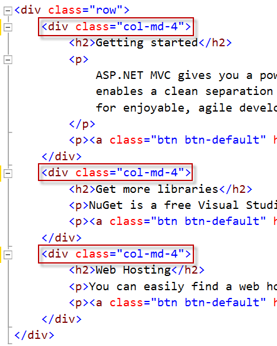
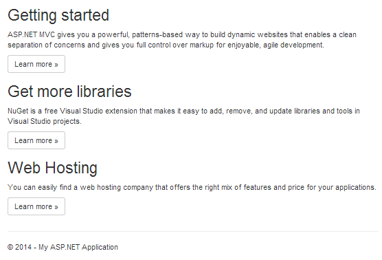
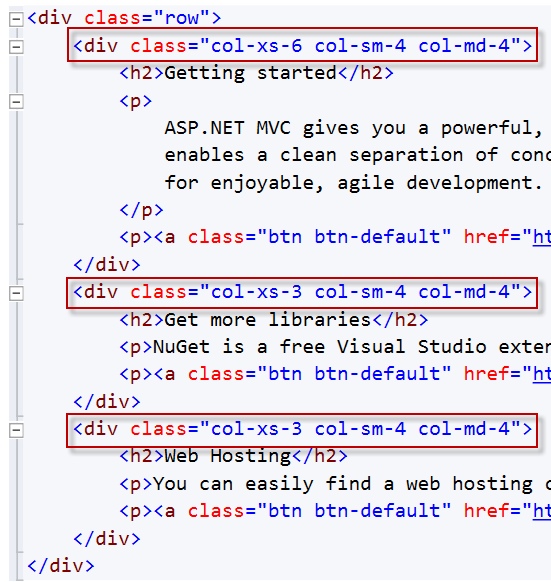

Bootstrap provides a powerful, responsive layout with its rows and columns. 
The common way to use Bootstrap's layout system is to create a basic grid which will appear as horizontal columns on the desktop but then stack on a smaller screen such as mobiles. This is done with a single set of .col-md-\* classes.

[[badExample]]
| 

[[badExample]]
| 

Did you know you can have more control over the responsive layout by including multiple column classes? The ability to control the layout across multiple screen sizes is a powerful tool within Bootstrap. For example, if you don't want your columns to stack on smaller devices, use the smaller grid classes by adding additional column classes (e.g. .col-xs-\* .col-sm-\*) to the respective

s. 
[[goodExample]]
| 

[[goodExample]]
| 
