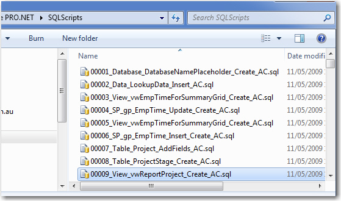

Every time a change is made to your product's SQL Server Database, script out the change. You can use SQL Management Studio or VS.NET (you can find old guys that still use Enterprise Manager or Query Analyzer), but every time you make changes you must save the change as a .sql script file so any alterations are scripted. 

 Everything you do on your database will be done at least three times ([once on development, once test and once on production](/do-you-have-separate-development-testing-and-production-environments)). Change control is one of the most important processes to ensuring a stable database system. 

 Keep the scripts in a separate directory with only .sql files 
 eg.  C:\Program Files\SSW Time PRO.NET\SQLScripts           (32 bit)
  or  C:\Program Files (x86)\SSW Time PRO.NET\SQLScripts  (64 bit)

 Later on you will get these 7 benefits:   
1. When you have an error you can see exactly which script introduced it
2. You don't have to use a compare tool like Red-Gate SQL Compare at the end of your development cycle
3. Your application can automatically make schema changes
4. The application can have a "Create" database button when installed for the first time
5. The application can have an "Upgrade" button and work out itself if this new version needs scripts to be run
6. The application can tell if it is an old version (as a newer version may have upgraded the schema), so you only use the latest clients
7. The application can have a "Reconcile" feature that compares the current schema to what it should be

 
**Is there a file naming convention to follow?**
 The script file naming convention should be XXXXX\_ObjectType\_ObjectName\_ColumnName\_Description\_SchemaMasterInitials.sql  

 eg.  00089\_Table\_Employee\_Gender\_ChangeFromBitToChar\_AC.sql 

**What are the rules for Entity Framework Code First?**

Similar principles apply when using Entity Framework Code First. Every change you do to the schema must be either saved in code or scripted out as per above. We recommend using Migrations feature of Entity Framework 6. It allows you to keep track of all the changes in the similar fashion as SQL Deploy. Watch [this video](http://tv.ssw.com/4902/use-code-first-entity-framework-brendan-richards) to learn more. We also recommend using SSW SQL Validate tool to make sure your schema hasn't been manually modified.
